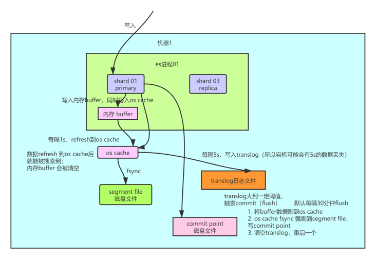
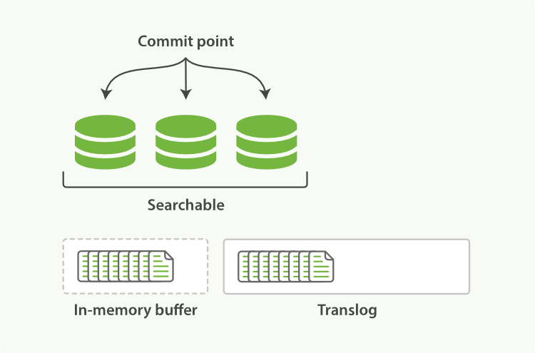

## 不变性

倒排索引被写入磁盘后是 *不可改变* 的:它永远不会修改。 不变性有重要的价值：

- 不需要锁。如果你从来不更新索引，你就不需要担心多进程同时修改数据的问题。
- 一旦索引被读入内核的文件系统缓存，便会留在哪里，由于其不变性。只要文件系统缓存中还有足够的空间，那么大部分读请求会直接请求内存，而不会命中磁盘。这提供了很大的性能提升。
- 其它缓存(像filter缓存)，在索引的生命周期内始终有效。它们不需要在每次数据改变时被重建，因为数据不会变化。
- 写入单个大的倒排索引允许数据被压缩，减少磁盘 I/O 和 需要被缓存到内存的索引的使用量。

当然，一个不变的索引也有不好的地方。主要事实是它是不可变的! 你不能修改它。如果你需要让一个新的文档 可被搜索，你需要重建整个索引。这要么对一个索引所能包含的数据量造成了很大的限制，要么对索引可被更新的频率造成了很大的限制。

## 动态更新索引

0. 一个 Lucene 索引包含一个提交点和三个段

1. 新文档被收集到内存索引缓存

   

**在一次提交后，一个新的段被添加到提交点而且缓存被清空。**

2. 不时地, 缓存被 *提交* ：

   - 一个新的段—一个追加的倒排索引—被写入磁盘。
   - 一个新的包含新段名字的 *提交点* 被写入磁盘。
   - 磁盘进行 *同步* — 所有在文件系统缓存中等待的写入都刷新到磁盘，以确保它们被写入物理文件。

3. 新的段被开启，让它包含的文档可见以被搜索。

4. 内存缓存被清空，等待接收新的文档。

   

当一个查询被触发，所有已知的段按顺序被查询。词项统计会对所有段的结果进行聚合，以保证每个词和每个文档的关联都被准确计算。 这种方式可以用相对较低的成本将新文档添加到索引。

## 写数据原理

### 过程

- 先写入内存 buffer，在 buffer 里的时候数据是搜索不到的；同时将数据写入 translog 日志文件。

  

  

- 如果 buffer 快满了，或者到一定时间，就会将内存 buffer 数据 `refresh` 到一个新的 `segment file` 中，但是此时数据不是直接进入 `segment file` 磁盘文件，而是先进入 `os cache` 。这个过程就是 `refresh`。

- 每隔 1 秒钟，es 将 buffer 中的数据写入一个**新的** `segment file`，每秒钟会产生一个**新的磁盘文件** `segment file`，这个 `segment file` 中就存储最近 1 秒内 buffer 中写入的数据。

- 但是如果 buffer 里面此时没有数据，那当然不会执行 refresh 操作，如果 buffer 里面有数据，默认 1 秒钟执行一次 refresh 操作，刷入一个新的 segment file 中。

- 操作系统里面，磁盘文件其实都有一个东西，叫做 `os cache`，即操作系统缓存，就是说数据写入磁盘文件之前，会先进入 `os cache`，先进入操作系统级别的一个内存缓存中去。只要 `buffer` 中的数据被 refresh 操作刷入 `os cache`中，这个数据就可以被搜索到了。

- 重复上面的步骤，新的数据不断进入 buffer 和 translog，不断将 `buffer` 数据写入一个又一个新的 `segment file` 中去，每次 `refresh` 完 buffer 清空，translog 保留。随着这个过程推进，translog 会变得越来越大。当 translog 达到一定长度的时候，就会触发 `commit` 操作。

- commit 操作发生第一步，就是将 buffer 中现有数据 `refresh` 到 `os cache` 中去，清空 buffer。然后，将一个 `commit point`写入磁盘文件，里面标识着这个 `commit point` 对应的所有 `segment file`，同时强行将 `os cache` 中目前所有的数据都 `fsync` 到磁盘文件中去。最后**清空** 现有 translog 日志文件，重启一个 translog，此时 commit 操作完成。

- 这个 commit 操作叫做 `flush`。默认 30 分钟自动执行一次 `flush`，但如果 translog 过大，也会触发 `flush`。flush 操作就对应着 commit 的全过程，我们可以通过 es api，手动执行 flush 操作，手动将 os cache 中的数据 fsync 强刷到磁盘上去。

  

  #### 近实时搜索

  > `NRT`，全称 `near real-time`。默认是每隔 1 秒 refresh 一次的，所以 es 是准实时的，因为写入的数据 1 秒之后才能被看到。可以通过 es 的 `restful api` 或者 `java api`，**手动**执行一次 refresh 操作，就是手动将 buffer 中的数据刷入 `os cache`中，让数据立马就可以被搜索到。只要数据被输入 `os cache` 中，buffer 就会被清空了，因为不需要保留 buffer 了，数据在 translog 里面已经持久化到磁盘去一份了。

  

  #### translog （事务日志）日志文件的作用是什么？

  > 你执行 commit 操作之前，数据要么是停留在 buffer 中，要么是停留在 os cache 中，无论是 buffer 还是 os cache 都是内存，一旦这台机器死了，内存中的数据就全丢了。所以需要将数据对应的操作写入一个专门的日志文件 translog 中，一旦此时机器宕机，再次重启的时候，es 会自动读取 translog 日志文件中的数据，恢复到内存 buffer 和 os cache 中去。

  

  #### refresh

  > - 这些在内存缓冲区的文档被写入到一个新的段中，且没有进行 `fsync` 操作。
  > - 这个段被打开，使其可被搜索。
  > - 内存缓冲区被清空。

  **刷新（refresh）完成后, 缓存被清空但是事务日志不会**，如图：

  

  

  #### flush（事务日志刷新）

  - 所有在内存缓冲区的文档都被写入一个新的段。
  - 缓冲区被清空。
  - 一个提交点被写入硬盘。
  - 文件系统缓存通过 `fsync` 被刷新（flush）。
  - 老的 translog 被删除。

  

   **在刷新（flush）之后，段被全量提交，并且事务日志被清空，如图**

实际上你在这里，如果面试官没有问你 es 丢数据的问题，你可以在这里给面试官炫一把，你说，其实 es 第一是准实时的，数据写入 1 秒后可以搜索到；**可能会丢失数据的**。有 5 秒的数据，停留在 buffer、translog os cache、segment file os cache 中，而不在磁盘上，此时如果宕机，会导致 5 秒的**数据丢失**。

#### 总结

数据先写入内存 buffer，然后每隔 1s，将数据 refresh 到 os cache，到了 os cache 数据就能被搜索到（所以我们才说 es 从写入到能被搜索到，中间有 1s 的延迟）。每隔 5s，将数据写入 translog 文件（这样如果机器宕机，内存数据全没，最多会有 5s 的数据丢失），translog 大到一定程度，或者默认每隔 30mins，会触发 commit 操作，将缓冲区的数据都 flush 到 segment file 磁盘文件中。

> 数据写入 segment file 之后，同时就建立好了倒排索引

## 删除/更新原理

如果是删除操作，commit 的时候会生成一个 `.del` 文件，里面将某个 doc 标识为 `deleted` 状态，那么搜索的时候根据 `.del` 文件就知道这个 doc 是否被删除了。

如果是更新操作，就是将原来的 doc 标识为 `deleted` 状态，然后新写入一条数据。

buffer 每 refresh 一次，就会产生一个 `segment file`，所以默认情况下是 1 秒钟一个 `segment file`，这样下来 `segment file` 会越来越多，此时会定期执行 merge。每次 merge 的时候，会将多个 `segment file` 合并成一个，同时这里会将标识为 `deleted` 的 doc 给**物理删除掉**，然后将新的 `segment file` 写入磁盘，这里会写一个 `commit point`，标识所有新的 `segment file`，然后打开 `segment file` 供搜索使用，同时删除旧的 `segment file`。

## 段合并

由于自动刷新流程每秒会创建一个新的段 ，这样会导致短时间内的段数量暴增。而段数目太多会带来较大的麻烦。 每一个段都会消耗文件句柄、内存和cpu运行周期。更重要的是，每个搜索请求都必须轮流检查每个段；所以段越多，搜索也就越慢。

Elasticsearch通过在后台进行段合并来解决这个问题。小的段被合并到大的段，然后这些大的段再被合并到更大的段。

段合并的时候会将那些旧的已删除文档从文件系统中清除。被删除的文档（或被更新文档的旧版本）不会被拷贝到新的大段中。

启动段合并不需要你做任何事。进行索引和搜索时会自动进行。这个流程像在 [Figure 25, “两个提交了的段和一个未提交的段正在被合并到一个更大的段”](https://www.elastic.co/guide/cn/elasticsearch/guide/current/merge-process.html#img-merge) 中提到的一样工作：

1、 当索引的时候，刷新（refresh）操作会创建新的段并将段打开以供搜索使用。

2、 合并进程选择一小部分大小相似的段，并且在后台将它们合并到更大的段中。这并不会中断索引和搜索。

Figure 25. 两个提交了的段和一个未提交的段正在被合并到一个更大的段

3、 [Figure 26, “一旦合并结束，老的段被删除”](https://www.elastic.co/guide/cn/elasticsearch/guide/current/merge-process.html#img-post-merge) 说明合并完成时的活动：

- 新的段被刷新（flush）到了磁盘。   写入一个包含新段且排除旧的和较小的段的新提交点。
- 新的段被打开用来搜索。
- 老的段被删除。

Figure 26. 一旦合并结束，老的段被删除

合并大的段需要消耗大量的I/O和CPU资源，如果任其发展会影响搜索性能。Elasticsearch在默认情况下会对合并流程进行资源限制，所以搜索仍然 有足够的资源很好地执行。