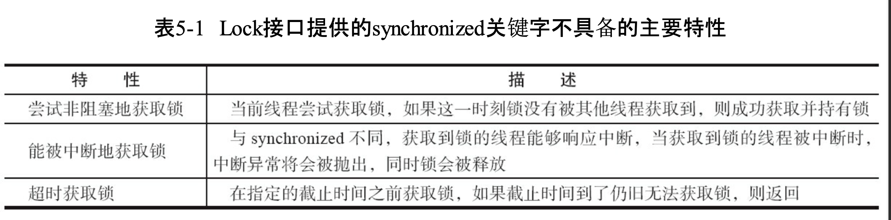
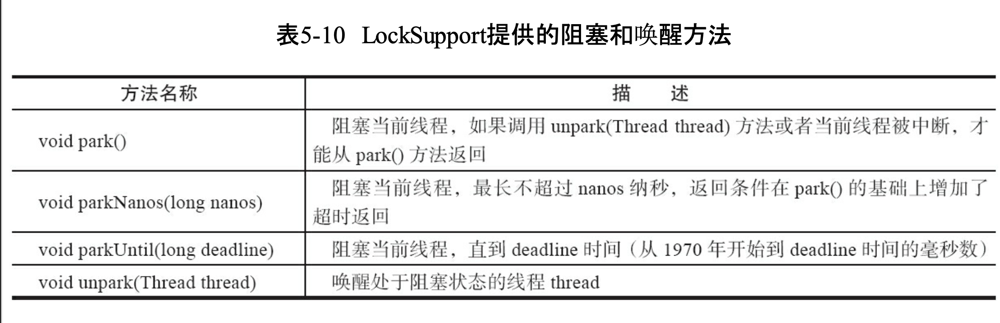

```java
public static void main(String[] args) {
        Lock lock = new ReentrantLock();
        lock.lock();
        try {
            // 业务逻辑
        } finally {
            lock.unlock();
        }
    }
```

- 这里将获取锁的过程放在了tyr块外，是为了防止在获取锁时发生异常，可以避免锁无故被释放。

  




- 锁是面向使用者的，它定义了使用者与锁交互的接口（比如可以允许两个线程并行访问），隐藏了实现细节
- 同步器面向的是锁的实现者，它简化了锁的实现方式，屏蔽了同步状态管理、线程的排队、等待与唤醒等底层操作。
- 锁和同步器很好地隔离了使用者和实现者所需关注的领域


## AQS vs 锁

​            同步器是实现锁(也可以是任意同步组件)的关键，在锁的实现中聚合同步器，利用同步器实现锁的语义。可以这样理解二者之间的关系:

- 锁是面向使用者的，它定义了使用者与锁交互的接口(比如可以允许两个线程并行访问)，隐藏了实现细节; 
- 同步器面向的是锁的实现者， 它简化了锁的实现方式，屏蔽了同步状态管理、线程的排队、等待与唤醒等底层操作。锁和同 步器很好地隔离了使用者和实现者所需关注的领域。


## 同步队列

数据结构：FIFO双向队列

​         入队列需要保证线程安全，通过CAS**设置尾节点**保证

​         同步队列遵循FIFO，首节点是获取同步状态成功的节点，首节点的线程在释放同步状态时，将会唤醒后继节点，而后继节点将会在获取同步状态成功时将自己设置为首节点。**设置首节点**是通过获取同步状态成功的线程来完成的，由于只有一个线程能够成功获取到同步状态，因此设置头节点的方法并不需要使用CAS来保证，它只需要将首节点设置成为原首节点的后继节点并断开原首节点的next引用即可。


## 重入锁

公平 vs 非公平

公平性锁保证了锁的获取按照FIFO原则，而代价是进行大量的线程切换。非公平性锁虽然可能造成线程“饥饿”，但极少的线程切换，保证了其更大的吞吐量。


# LockSupport




