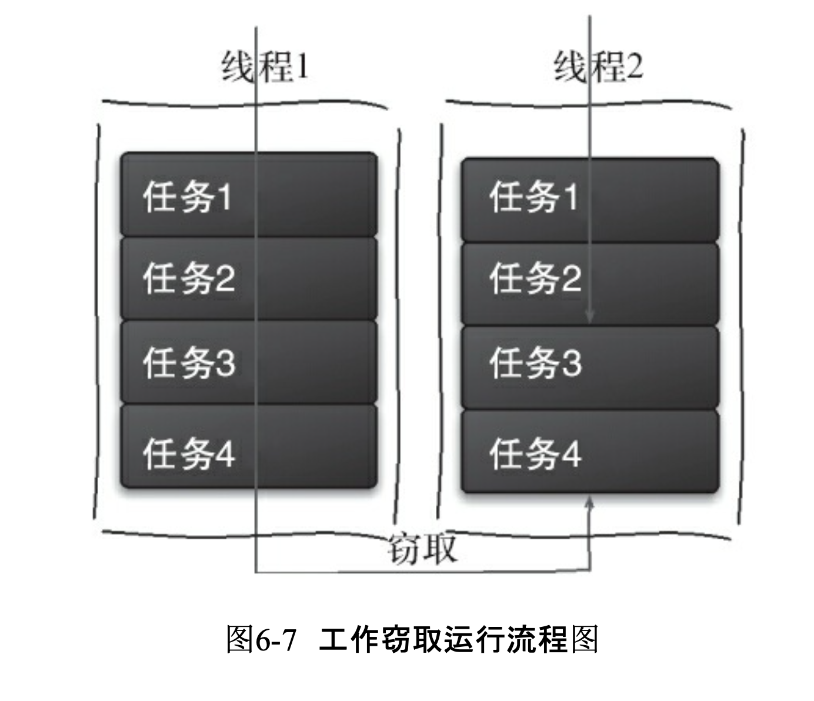

## Wrok- stealing算法

> 指某个线程从其他队列里窃取任务来执行。
>
> 假如我们需要做一个比较大的任务，可以把这个任务分割为若干 互不依赖的子任务，为了减少线程间的竞争，把这些子任务分别放到不同的队列里，并为每个 队列创建一个单独的线程来执行队列里的任务，线程和队列一一对应。比如A线程负责处理A 队列里的任务。但是，有的线程会先把自己队列里的任务干完，而其他线程对应的队列里还有 任务等待处理。干完活的线程与其等着，不如去帮其他线程干活，于是它就去其他线程的队列 里窃取一个任务来执行。而在这时它们会访问同一个队列，所以为了减少窃取任务线程和被 窃取任务线程之间的竞争，通常会使用双端队列，被窃取任务线程永远从双端队列的头部拿 任务执行，而窃取任务的线程永远从双端队列的尾部拿任务执行。

优点:充分利用线程进行并行计算，减少了线程间的竞争。

缺点:在某些情况下还是存在竞争，比如双端队列里只有一个任务时。并 且该算法会消耗了更多的系统资源，比如创建多个线程和多个双端队列。

### 为什么ThreadPoolExecutor不能使用分治法？

> 所以当使用ThreadPoolExecutor时，使用分治法会存在问题，因为ThreadPoolExecutor中的线程无法向任务队列中再添加一个任务并且在等待该任务完成之后再继续执行。而`使用ForkJoinPool时，就能够让其中的线程创建新的任务，并挂起当前的任务，此时线程就能够从队列中选择子任务执行`。

### ThreadPoolExecutor或者ForkJoinPool，会有什么性能的差异呢？

> 首先，使用ForkJoinPool能够使用数量有限的线程来完成非常多的具有「父子关系」的任务，比如使用4个线程来完成超过200万个任务。使用ThreadPoolExecutor 时，是不可能完成的，因为ThreadPoolExecutor中的Thread无法选择优先执行子任务，需要完成200万个具有父子关系的任务时，也需要200万个线程，显然这是不可行的。

