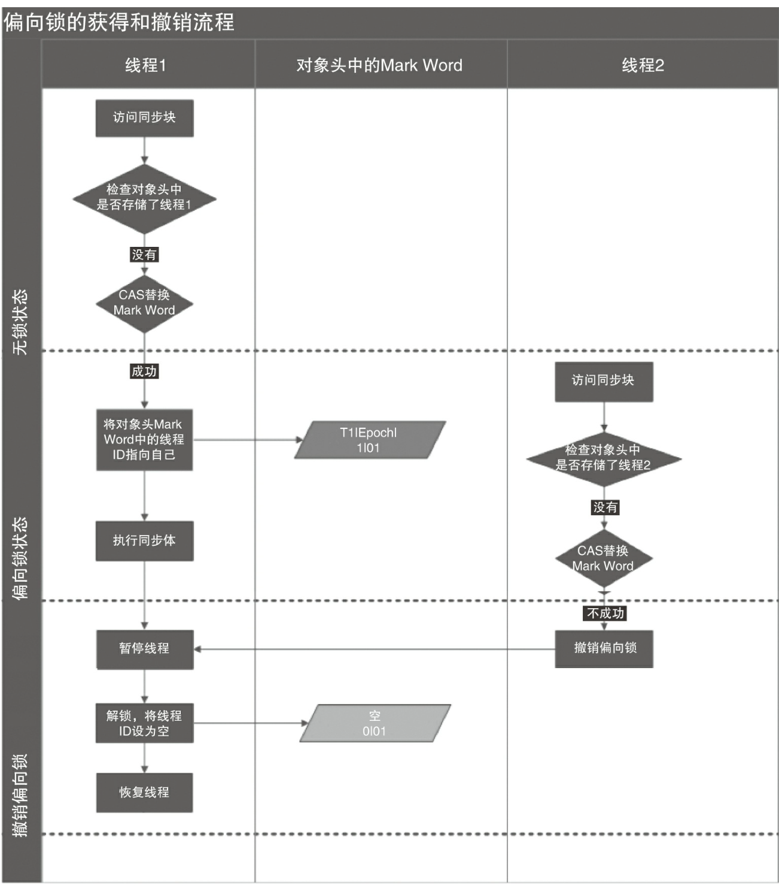
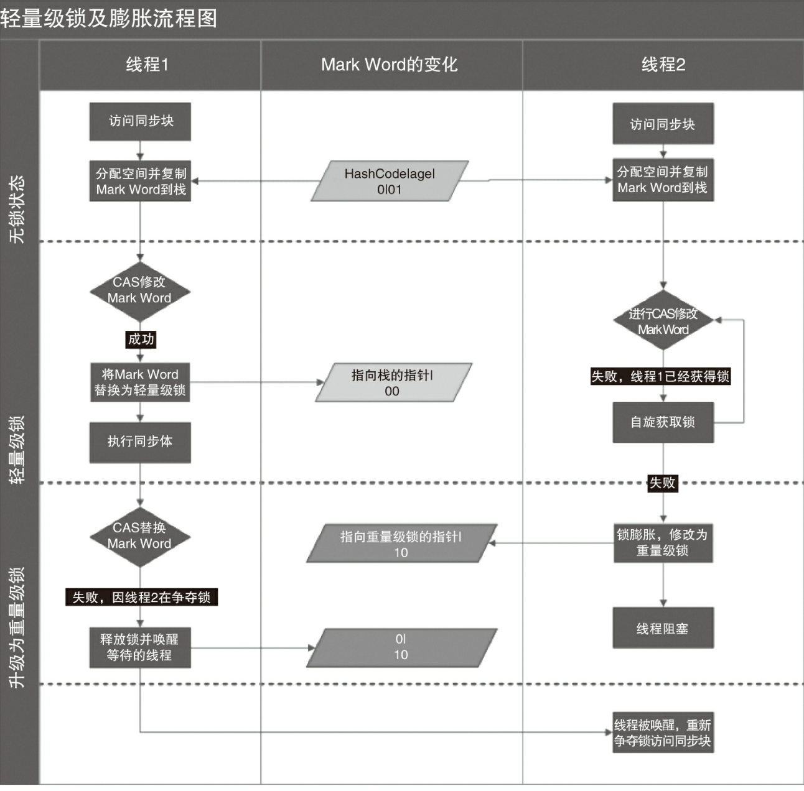
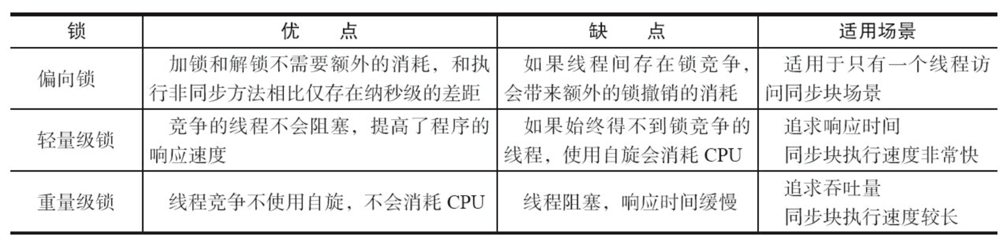

## 三种形式

1. 对于普通同步方法，锁是当前实例对象。
2. 对于静态同步方法，锁是当前类的Class对象。
3. 对于同步方法块，锁是Synchonized括号里配置的对象。

## 实现原理

通过**monitorenter**和**monitorexit**指令实现

### 对象头

synchronized用的锁是存在Java对象头里的

结构

- Mark Word（存储对象的HashCode、分代年龄和**锁标记位**）

### 锁升级

​	锁一共有4种状态，级别从低到高依次是:无锁状态、偏向锁状态、轻量级锁状态和重量级锁状态，这几个状态会随着竞争情况逐渐升级。**锁可以升级但不能降级**，意味着偏向锁升级成轻量级锁后不能降级成偏向锁。这种锁升级却不能降级的策略，目的是为了提高 获得锁和释放锁的效率

#### 1. 偏向锁

   大多数情况下，锁不仅不存在多线程竞争，而且总是由同 一线程多次获得，为了让线程获得锁的代价更低而引入了偏向锁。当一个线程访问同步块并 获取锁时，**会在对象头和栈帧中的锁记录里存储锁偏向的线程ID**，以后该线程在进入和退出 同步块时不需要进行CAS操作来加锁和解锁，只需简单地测试一下对象头的Mark Word里是否 存储着指向当前线程的偏向锁。如果测试成功，表示线程已经获得了锁。如果测试失败，则需 要再测试一下Mark Word中偏向锁的标识是否设置成1(表示当前是偏向锁):如果没有设置，则 使用CAS竞争锁;如果设置了，则尝试使用CAS将对象头的偏向锁指向当前线程。

**目的**

消除数据在无竞争情况下的同步原语

   **撤销**

   - **时机**：等到竞争出现才释放锁的机制，所以当其他线程尝试竞争偏向锁时， 持有偏向锁的线程才会释放锁

#### 2. 轻量级锁

### 对比

