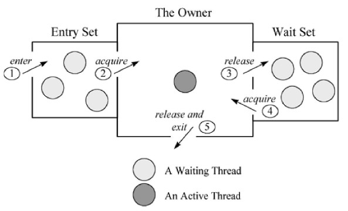

## 作用

1. 原子性：确保线程互斥的访问同步代码
2. 可见性：保证共享变量的修改能够及时可见，其实是通过Java内存模型中的 “**对一个变量unlock操作之前，必须要同步到主内存中；如果对一个变量进行lock操作，则将会清空工作内存中此变量的值，在执行引擎使用此变量前，需要重新从主内存中load操作或assign操作初始化变量值**” 来保证的
3. 有序性：有效解决重排序问题，即 “一个unlock操作先行发生(happen-before)于后面对同一个锁的lock操作”


## 三种形式

1. 对于普通同步方法，锁是当前实例对象。
2. 对于静态同步方法，锁是当前类的Class对象。
3. 对于同步方法块，锁是Synchonized括号里配置的对象。


## 实现原理

通过**monitorenter**和**monitorexit**指令实现

1. MonitorEnter指令
   - 插入在同步代码块的开始位置，当代码执行到该指令时，将会尝试获取该对象Monitor的所有权，即尝试获得该对象的锁
2. MonitorExit指令
   - 插入在方法结束处和异常处，JVM保证每个MonitorEnter必须有对应的MonitorExit


### Monitor对象

```c++
ObjectMonitor() {
    _header       = NULL;
    _count        = 0; // 记录个数
    _waiters      = 0,
    _recursions   = 0;
    _object       = NULL;
    _owner        = NULL;
    _WaitSet      = NULL; // 处于wait状态的线程，会被加入到_WaitSet
    _WaitSetLock  = 0 ;
    _Responsible  = NULL ;
    _succ         = NULL ;
    _cxq          = NULL ;
    FreeNext      = NULL ;
    _EntryList    = NULL ; // 处于等待锁block状态的线程，会被加入到该列表
    _SpinFreq     = 0 ;
    _SpinClock    = 0 ;
    OwnerIsThread = 0 ;
  }
```

ObjectMonitor中有两个队列，_WaitSet 和 _EntryList，用来保存ObjectWaiter对象列表（ 每个等待锁的线程都会被封装成ObjectWaiter对象 ），_owner指向持有ObjectMonitor对象的线程，当多个线程同时访问一段同步代码时：

> 1. 首先会进入 _EntryList 集合，当线程获取到对象的monitor后，进入 _Owner区域并把monitor中的owner变量设置为当前线程，同时monitor中的计数器count加1
> 2. 若线程调用 wait() 方法，将释放当前持有的monitor，owner变量恢复为null，count自减1，同时该线程进入 WaitSet集合中等待被唤醒
> 3. 若当前线程执行完毕，也将释放monitor（锁）并复位count的值，以便其他线程进入获取monitor(锁)；

同时**，Monitor对象存在于每个Java对象的对象头Mark Word中（存储的指针的指向），Synchronized锁便是通过这种方式获取锁的，也是为什么Java中任意对象可以作为锁的原因，同时notify/notifyAll/wait等方法会使用到Monitor锁对象，所以必须在同步代码块中使用。**



如上图所示，一个线程通过1号门进入Entry Set(入口区)，如果在入口区没有线程等待，那么这个线程就会获取监视器成为监视器的Owner，然后执行监视区域的代码。如果在入口区中有其它线程在等待，那么新来的线程也会和这些线程一起等待。线程在持有监视器的过程中，有两个选择，一个是正常执行监视器区域的代码，释放监视器，通过5号门退出监视器；还有可能等待某个条件的出现，于是它会通过3号门到Wait Set（等待区）休息，直到相应的条件满足后再通过4号门进入重新获取监视器再执行。

注意：

> 当一个线程释放监视器时，在入口区和等待区的等待线程都会去竞争监视器，如果入口区的线程赢了，会从2号门进入；如果等待区的线程赢了会从4号门进入。只有通过3号门才能进入等待区，在等待区中的线程只有通过4号门才能退出等待区，也就是说一个线程只有在持有监视器时才能执行wait操作，处于等待的线程只有再次获得监视器才能退出等待状态。


### 对象头

synchronized用的锁是存在Java对象头里的

结构

- Mark Word（存储对象的HashCode、分代年龄和**锁标记位**）


### 锁升级

​	锁一共有4种状态，级别从低到高依次是:无锁状态、偏向锁状态、轻量级锁状态和重量级锁状态，这几个状态会随着竞争情况逐渐升级。**锁可以升级但不能降级**，意味着偏向锁升级成轻量级锁后不能降级成偏向锁。这种锁升级却不能降级的策略，目的是为了提高 获得锁和释放锁的效率


#### 1. 偏向锁

   大多数情况下，锁不仅不存在多线程竞争，而且总是由同 一线程多次获得，为了让线程获得锁的代价更低而引入了偏向锁。当一个线程访问同步块并 获取锁时，**会在对象头和栈帧中的锁记录里存储锁偏向的线程ID**，以后该线程在进入和退出 同步块时不需要进行CAS操作来加锁和解锁，只需简单地测试一下对象头的Mark Word里是否 存储着指向当前线程的偏向锁。如果测试成功，表示线程已经获得了锁。如果测试失败，则需 要再测试一下Mark Word中偏向锁的标识是否设置成1(表示当前是偏向锁):如果没有设置，则 使用CAS竞争锁;如果设置了，则尝试使用CAS将对象头的偏向锁指向当前线程。


**目的**

消除数据在无竞争情况下的同步原语


   **撤销**

   - **时机**：等到竞争出现才释放锁的机制，所以当其他线程尝试竞争偏向锁时， 持有偏向锁的线程才会释放锁


#### 2. 轻量级锁


### 对比


>https://www.cnblogs.com/aspirant/p/11470858.html
