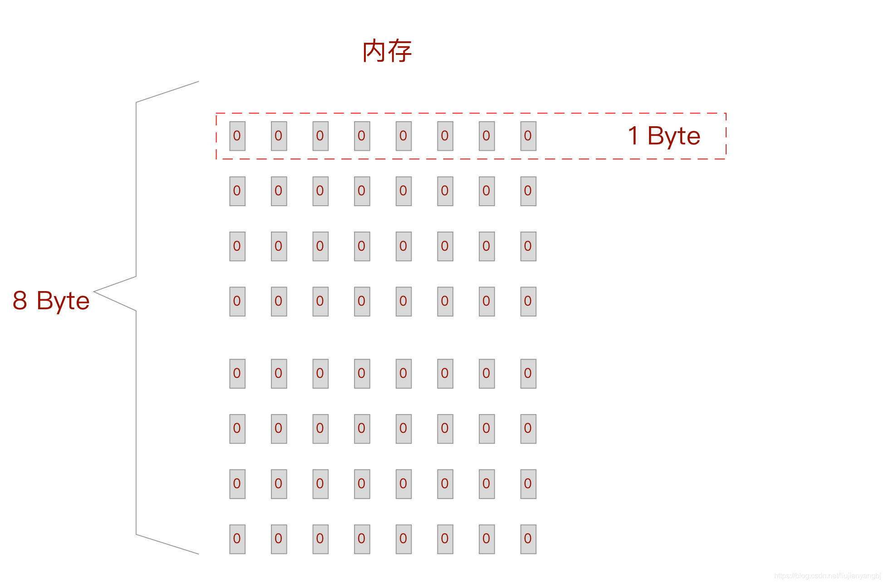

# 一、对 2^32 = 4GB的疑惑
32位最大支持4G内存，到底是怎么算出来的？

去网上搜索答案，大部分都会甩给一个公式

2^32 = 4GB

我当时看到这个公式的时候，没太在意，后来我自己换算了一下，发现和我理解的不一样，我换算出来后不是4G而是512M也就是0.5G。

32位就可以表示有2的32次种情况，就表示可以指向232 个地址，而最大的数字就表示可以访问的内存最大的容量，再大了，由于地址表示不了，所以就无法使用了。所以我就按下面方法进行了换算：

232 bit = 229 byte = 219 KB = 29 MB = 2-1 GB = 0.5 GB

这样一算就是32位最大只能寻址的范围就是 0.5GB啊 怎么算出是4GB呢？

# 二、聊一下内存
## 1.内存的特性
内存是计算机系统的主存储器。
而CPU计算的时候不能直接访问硬盘的数据，但是可以直接访问内存的里的数据。

## 2.内存的基本结构
内存也是存储介质，内存里存放的数据其实也是只是存放0或者1这两个二进制数字，所以可以内存里有海量的小格子，每1个格子是1个bit，小格子里面就只能存放0或1。

那么如果要表示数值255需要几个格子来放呢？
根据二进制算法就是用8个格子，每个格子都是1，来表示255.

计算机规定8bit=1byte 就是1字节=8位。

内存的大小就根据格子的多少来进行计算的。

下面图片就表示一个8byte大小的内存

例如一个4GB的内存到底有多少格子呢？
那就将4GB转换为bit就可以了
4GB = 2^2 GB = 2^12 MB = 2^22 KB = 2^32 byte = 2^35 bit

也就是4GB的内存有 2^35 个格子。

如果每一个格子一个地址的话？那么要想全部都访问4GB的内存就需要 35位，32位是不够的。

那么32位操作系统是怎么做到可以访问4GB内存的呢？

**实际上内存是把8个bit排成1组， 每1组成为1个单位， 大小是1byte(字节）， cpu每一次只能访问1个byte， 而不能单独去访问具体的1个小格子(bit). 1个byte字节就是内存的最小的IO单位.**

## 3.内存地址的概念
既然内存的最小IO单位是字节byte，那么我们其实不需要为每一个格子也就是每一bit去分配地址了，而是按照8个bit为一组，也就是一个字节分配一个地址。

其实计算机操作系统会给内存每1个字节分配1个内存地址, cpu只需要知道某个数据类型的地址, 就可以直接去到读影的内存位置去提取数据了。

# 总结
明白了上面的道理，
我们再算一下，其实32位表示 2^32 个地址，而每一个地址是指向的是 8bit为一组的 byte ，所以要算到寻址的话，就要在乘以8 ，也就是 2^35 个bit，这样再换算为GB就是 4GB了。

到此终于明白了4GB是怎么算出来的了，**原来 “32位操作系统” 中的“位”并不是 内存中的“bit”的概念，对应到内存中其实是“字节byte”，所以才有了 232 = 4GB 的说明法**
