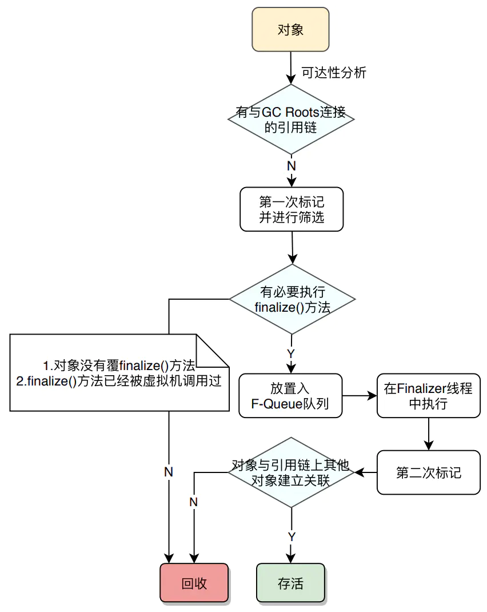
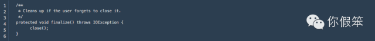

# finalize() 方法

​             一个对象真正宣告死亡，至少要经历两次标记过程：如果对象在进行可达性分析之后发现没有与GC Roots相连接的引用链，那它将被**第一次标记**并且进行一次筛选。**筛选的条件是此对象是否有必要执行finalize()方法。**

 当遇到以下两种情况时，虚拟机将视为“没有必要执行”：

1. 对象是否覆盖finalize()方法
2. finalize()方法已经被虚拟机调用过

​             如果这个对象被判定为有必要执行finalize()方法，那么这个对象将会被放置在一个F-Queue的队列中，并在稍后由一个由虚拟机自动建立的、低优先级的Finalizer线程执行。

**注：这里的“执行”指的是虚拟机有机会触发这个方法，但并不承诺会等待它运行结束。**因为一个对象在finalize()方法中执行是非常缓慢的，甚至有可能会发生死循环，将会导致F-Queue队列中其他对象永久处于等待，甚至导致整个内存回收系统崩溃。

​             finalize()方法是对象逃脱死亡命运的最后一次机会，稍后GC将对F-Queue中的对象进行**第二次小规模的标记，**如果对象在finalize()方法中拯救自己（重新与引用链上任何一个对象建立关联），那么在第二次标记时它将被**移除“即将回收”的集合**，如果对象这时候还没有逃脱，那基本上就真的被回收了~~~（gg




# FinalReference源码分析

```java
class FinalReference<T> extends Reference<T> {

    public FinalReference(T referent, ReferenceQueue<? super T> q) {
        super(referent, q);
    }

    @Override
    public boolean enqueue() {
        throw new InternalError("should never reach here");
    }
}
```

大家应该注意到了类访问权限是package的，这也就意味着我们不能直接去对其进行扩展，但是JDK里对此类进行了扩展实现`java.lang.ref.Finalizer`，这个类也是我们在概述里提到的，而此类的访问权限也是package的，并且是final的，意味着真的不能被扩展了，接下来的重点我们围绕`java.lang.ref.Finalizer`展开 (PS：后续讲Finalizer相关的其实也就是在说FinalReference)

```java
final class Finalizer extends FinalReference<Object> { /* Package-private; must be in
                                                          same package as the Reference
                                                          class */

    private static ReferenceQueue<Object> queue = new ReferenceQueue<>();

    /** Head of doubly linked list of Finalizers awaiting finalization. */
    private static Finalizer unfinalized = null;

    /** Lock guarding access to unfinalized list. */
    private static final Object lock = new Object();

    private Finalizer next, prev;

    private Finalizer(Object finalizee) {
        super(finalizee, queue);
        // push onto unfinalized
        synchronized (lock) {
            if (unfinalized != null) {
                this.next = unfinalized;
                unfinalized.prev = this;
            }
            unfinalized = this;
        }
    }
  
  /* Invoked by VM */
    static void register(Object finalizee) {
        new Finalizer(finalizee);
    }
  
    ……
}
```

### Finalizer的构造函数

从构造函数上我们获得下面的几个关键信息

* private：意味着我们在外面无法自己构建这类对象 
* finalizee参数：FinalReference指向的对象引用 
* 将当前对象插入到Finalizer对象链里，链里的对象和Finalizer类静态相关联，言外之意是在这个链里的对象都无法被gc掉，除非将这种引用关系剥离掉（因为Finalizer类无法被unload）。

虽然外面无法创建Finalizer对象，但是注意到有一个register的静态方法，在方法里会创建这种对象，同时将这个对象加入到Finalizer对象链里，这个方法是被vm调用的，那么问题来了，vm在什么情况下会调用这个方法呢？

### Finalizer对象何时被注册到Finalizer对象链里

类其实有挺多的修饰，比如final，abstract，public等等，如果一个类有final修饰，我们就说这个类是一个final类，上面列的都是语法层面我们可以显示标记的，在jvm里其实还给类标记其他一些符号，比如finalizer，表示这个类是一个Finalizer类（为了和java.lang.ref.Fianlizer类进行区分，下文要提到的finalizer类的地方都说成f类），gc在处理这种类的对象的时候要做一些特殊的处理，如在这个对象被回收之前会调用一下它的finalize方法。

###  如何判断一个类是不是一个f类

在讲这个问题之前，我们先来看下`java.lang.Object`里的一个方法

```java
protected void finalize() throws Throwable { }
```

在Object类里定义了一个名为finalize的空方法，这意味着Java世界里的所有类都会继承这个方法，甚至可以覆写该方法，并且根据方法覆写原则，如果子类覆盖此方法，方法访问权限都是至少是protected级别的，这样其子类就算没有覆写此方法也会继承此方法。

而判断当前类是否是一个f类的标准并不仅仅是当前类是否含有一个参数为空，返回值为void的名为finalize的方法，而另外一个要求是`finalize方法必须非空`，因此我们的Object类虽然含有一个finalize方法，但是并不是一个f类，Object的对象在被gc回收的时候其实并不会去调用它的finalize方法。

需要注意的是我们的类在被加载过程中其实就已经被标记为是否为f类了（遍历所有方法，包括父类的方法，只要有一个非空的参数为空返回void的finalize方法就认为是一个f类）。

### f类的对象何时传到Finalizer.register方法

对象的创建其实是被拆分成多个步骤的，比如`A a=new A(2)`这样一条语句对应的字节码如下：


先执行new分配好对象空间，然后再执行invokespecial调用构造函数，jvm里其实可以让用户选择在这两个时机中的任意一个将当前对象传递给Finalizer.register方法来注册到Finalizer对象链里，这个选择依赖于RegisterFinalizersAtInit这个vm参数是否被设置，默认值为true，也就是在调用构造函数返回之前调用Finalizer.register方法，如果通过-XX:-RegisterFinalizersAtInit关闭了该参数，那将在对象空间分配好之后就将这个对象注册进去。

另外需要提一点的是当我们通过clone的方式复制一个对象的时候，如果当前类是一个f类，那么在clone完成的时候将调用Finalizer.register方法进行注册。 

### hotspot如何实现f类对象在构造函数执行完毕后调用Finalizer.register

这个实现比较有意思，在这里简单提一下，我们知道一个构造函数执行的时候，会去调用父类的构造函数，主要是为了能对继承自父类的属性也能做初始化，那么任何一个对象的初始化最终都会调用到Object的空构造函数里（任何空的构造函数其实并不空，会含有三条字节码指令，如下代码所示），为了不对所有的类的构造函数都做埋点调用Finalizer.register方法，hotspot的实现是在Object这个类在做初始化的时候将构造函数里的`return`指令替换为`_return_register_finalizer`指令，该指令并不是标准的字节码指令，是hotspot扩展的指令，这样在处理该指令的时候调用Finalizer.register方法，这样就在侵入性很小的情况下完美地解决了这个问题。


## f类对象的GC回收

### FinalizerThread线程

在Finalizer类的clinit方法（静态块）里我们看到它会创建了一个FinalizerThread的守护线程，这个线程的优先级并不是最高的，意味着在cpu很紧张的情况下其被调度的优先级可能会受到影响

```java
private static class FinalizerThread extends Thread {
    private volatile boolean running;
    FinalizerThread(ThreadGroup g) {
        super(g, null, "Finalizer", 0, false);
    }
    public void run() {
        // in case of recursive call to run()
        if (running)
            return;

        // Finalizer thread starts before System.initializeSystemClass
        // is called.  Wait until JavaLangAccess is available
        while (VM.initLevel() == 0) {
            // delay until VM completes initialization
            try {
                VM.awaitInitLevel(1);
            } catch (InterruptedException x) {
                // ignore and continue
            }
        }
        final JavaLangAccess jla = SharedSecrets.getJavaLangAccess();
        running = true;
        for (;;) {
            try {
                Finalizer f = (Finalizer)queue.remove();
                f.runFinalizer(jla);
            } catch (InterruptedException x) {
                // ignore and continue
            }
        }
    }
}

static {
    ThreadGroup tg = Thread.currentThread().getThreadGroup();
    for (ThreadGroup tgn = tg;
         tgn != null;
         tg = tgn, tgn = tg.getParent());
    Thread finalizer = new FinalizerThread(tg);
    finalizer.setPriority(Thread.MAX_PRIORITY - 2);
    finalizer.setDaemon(true);
    finalizer.start();
}
```

这个线程主要就是从queue里取Finalizer对象，然后执行该对象的runFinalizer方法，这个方法主要是将Finalizer对象从Finalizer对象链里剥离出来，这样意味着下次gc发生的时候就可能将其关联的f对象gc掉了，最后将这个Finalizer对象关联的f对象传给了一个native方法invokeFinalizeMethod

其实invokeFinalizeMethod方法就是调了这个f对象的finalize方法，看到这里大家应该恍然大悟了，整个过程都串起来了

### f对象的finalize方法抛出异常会导致FinalizeThread退出吗

不知道大家有没有想过如果f对象的finalize方法抛了一个没捕获的异常，这个FinalizerThread会不会退出呢，细心的读者看上面的代码其实就可以找到答案，在runFinalizer方法里对Throwable的异常都进行了捕获，因此不可能出现FinalizerThread因异常未捕获而退出的情况。

###  f对象的finalize方法会执行多次吗

如果我们在f对象的finalize方法里重新将当前对象赋值出去，变成可达对象，当这个f对象再次变成不可达的时候还会被执行finalize方法吗？答案是否定的，因为在执行完第一次finalize方法之后，这个f对象已经和之前的Finalizer对象关系剥离了，也就是下次gc的时候不会再发现Finalizer对象指向该f对象了，自然也就不会调用这个f对象的finalize方法了。

### Finalizer对象何时被放到ReferenceQueue里

除了这里要说的环节之外，整个过程大家应该都比较清楚了。

当gc发生的时候，gc算法会判断f类对象是不是只被Finalizer类引用（f类对象被Finalizer对象引用，然后放到Finalizer对象链里），如果这个类仅仅被Finalizer对象引用的时候，说明这个对象在不久的将来会被回收了现在可以执行它的finalize方法了，于是会将这个Finalizer对象放到Finalizer类的ReferenceQueue里，但是这个f类对象其实并没有被回收，因为Finalizer这个类还对他们持有引用，在gc完成之前，jvm会调用ReferenceQueue里的lock对象的notify方法（当ReferenceQueue为空的时候，FinalizerThread线程会调用ReferenceQueue的lock对象的wait方法直到被jvm唤醒），此时就会执行上面FinalizeThread线程里看到的其他逻辑了。

## Finalizer导致的内存泄露

这里举一个简单的例子，我们使用挺广的socket通信，SocksSocketImpl的父类其实就实现了finalize方法:


其实这么做的主要目的是万一用户忘记关闭socket了，那么在这个对象被回收的时候能主动关闭socket来释放一些系统资源，但是如果真的是用户忘记关闭了，那这些socket对象可能因为FinalizeThread迟迟没有执行到这些socket对象的finalize方法，而导致内存泄露，这种问题我们碰到过多次，需要特别注意的是对于已经没有地方引用的这些f对象，并不会在最近的那一次gc里马上回收掉，而是会延迟到下一个或者下几个gc时才被回收，因为执行finalize方法的动作无法在gc过程中执行，万一finalize方法执行很长呢，所以只能在这个gc周期里将这个垃圾对象重新标活，直到执行完finalize方法从queue里删除，这样下次gc的时候就真的是漂浮垃圾了会被回收，因此给大家的一个建议是千万不要在运行期不断创建f对象，不然会很悲剧。

## Finalizer的客观评价

上面的过程基本对Finalizer的实现细节进行完整剖析了，java里我们看到有构造函数，但是并没有看到析构函数一说，Finalizer其实是实现了析构函数的概念，我们在对象被回收前可以执行一些『收拾性』的逻辑，应该说是一个特殊场景的补充，但是这种概念的实现给我们的f对象生命周期以及gc等带来了一些影响： 

- f对象因为Finalizer的引用而变成了一个临时的强引用，即使没有其他的强引用了，还是无法立即被回收
- f对象至少经历两次GC才能被回收，因为只有在FinalizerThread执行完了f对象的finalize方法的情况下才有可能被下次gc回收，而有可能期间已经经历过多次gc了，但是一直还没执行f对象的finalize方法
- cpu资源比较稀缺的情况下FinalizerThread线程有可能因为优先级比较低而延迟执行f对象的finalize方法
- 因为f对象的finalize方法迟迟没有执行，有可能会导致大部分f对象进入到old分代，此时容易引发old分代的gc，甚至fullgc，gc暂停时间明显变长
- f对象的finalize方法被调用了，但是这个对象其实还并没有被回收，虽然可能在不久的将来会被回收
