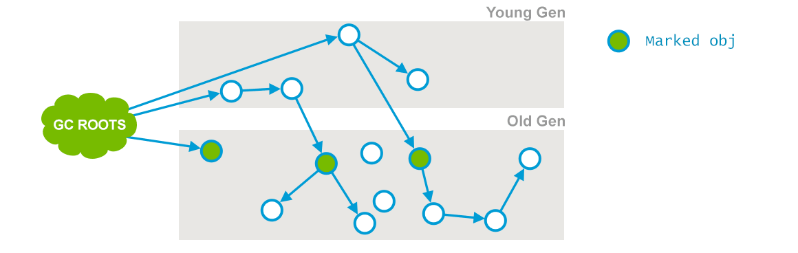
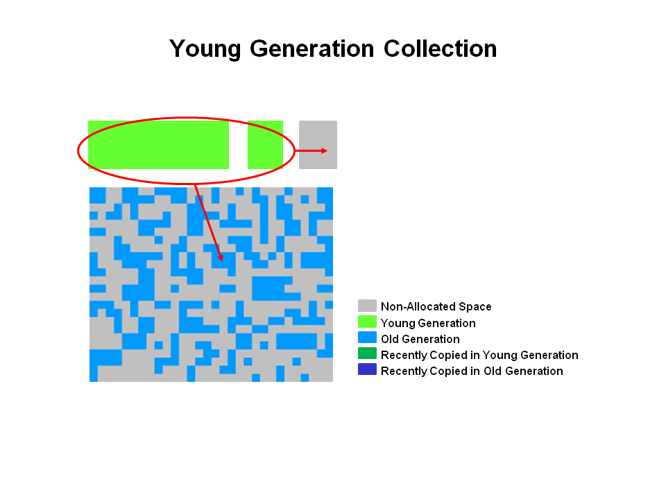
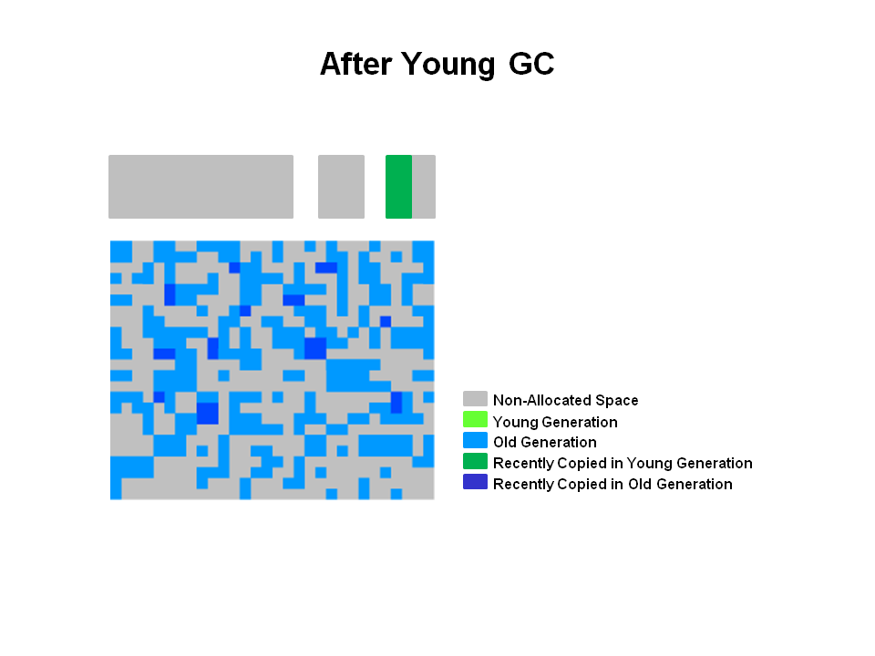
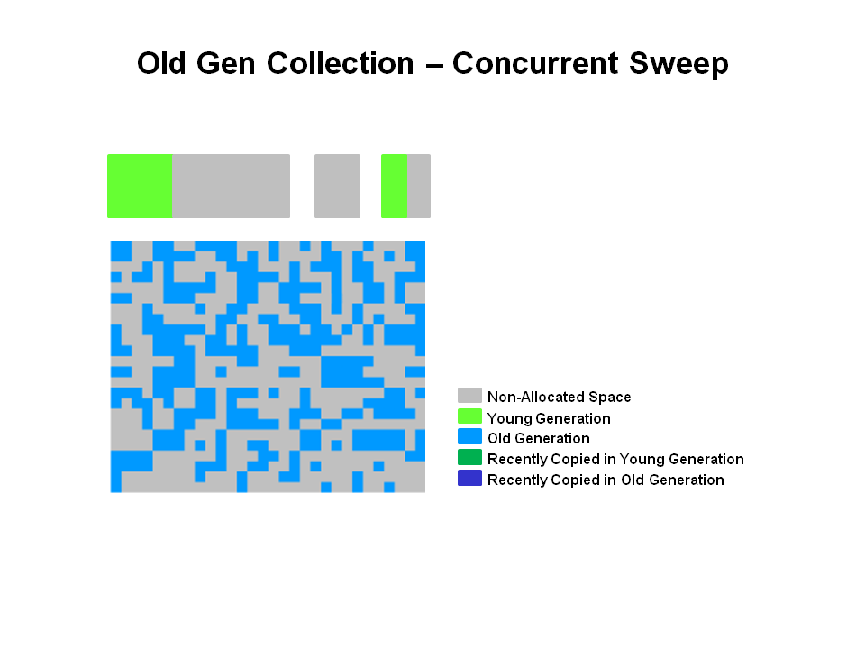
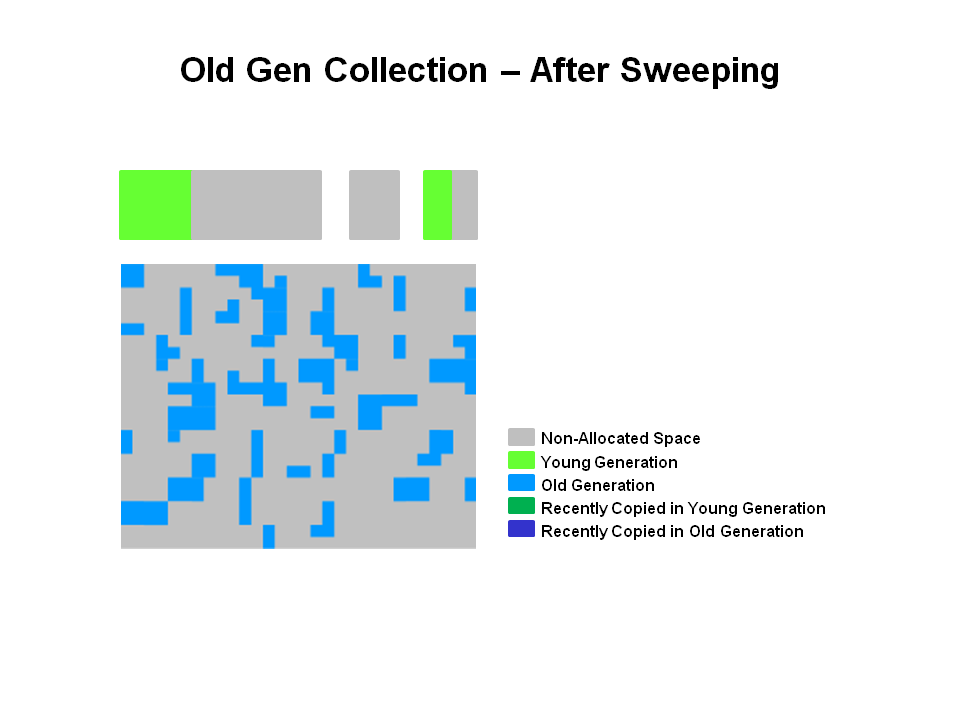

- 收集器是一种以获取最短回收停顿时间为目标的收集器
- 算法：标记—清除
- 默认情况下在老年代使用了68%及以上的内存的时候就开始CMS。
- 老年代垃圾收集器

## 步骤

1. **初始标记（CMS initial mark）** 

   

   - 仅仅只是标记一下GCRoots能直接关联到的对象，**速度很快**；（一是标记老年代中所有的GC Roots所指的**直接对象**；二是标记被年轻代中存活对象引用的**直接对象**。）

   - 会**Stop the world**

2. **并发标记（CMS concurrent mark）**

   

   - 从GC Roots的直接关联对象开始遍历整个对象图的过程，**这个过程耗时较长**但是不需要停顿用户线程，可以与垃圾收集线程一起并发运行；
   - 在初始标记的基础上继续往下遍历其他的对象引用并进行标记，该过程会和用户线程**并发**地执行，不会发生停顿。这个阶段会从initial mark阶段中所标记的节点往下检索，标记出所有老年代中存活的对象。注意此时会有部分对象的引用被改变，如上图中的current obj原本所引用的节点已经失去了关联。

3. **重新标记（CMS remark）** 

   - 是为了修正并发标记期间，因用户程序继续运作而导致标记产生变动的那一部分对象的标记记录，这个阶段的停顿时间通常会比初始标记阶段稍长一些，但也远比并发标记阶段的时间短
   - 会**Stop the world**

4. **并发清除（CMS concurrent sweep）**

   - 清理删除掉标记阶段判断的已经死亡的对象，由于不需要移动存活对象，所以这个阶段也是可以与用户线程同时并发的

​	由于整个过程耗时最长的并发标记和并发清除过程，收集器都可以与用户线程一起工作，所以，从总体上来说，CMS收集器的内存回收过程是与用户线程并发进行的。

## 分代垃圾回收与CMS

- CMS是作用于老年代的垃圾收集器，它通过使垃圾回收工作和应用线程并发进行来达到最小化垃圾回收停顿时间，通常来讲，并发低延迟的收集器并不会拷贝和压缩活着的对象，回收完成之后，活着的对象是不动的，那么这就引发了潜在的碎片问题，当碎片化严重时，就会去请求一个更大的堆。

- CMS的回收各阶段如下表所示：

  | 阶段                 | 描述                                                         |
  | :------------------- | :----------------------------------------------------------- |
  | （1）初始标记（STW） | 依据可达性分析算法标记直接可达的对象，老年代中那些被标记为可达的对象也包括可能是被年轻代中的对象引用的。相对于young GC来说，初始标记的停顿时间通常会很短，因为它跟堆的大小无关，只跟GC Roots数量有关。 |
  | （2）并发标记        | 在Java应用线程执行的同时，从上一步中跟GC Roots直接关联的对象开始扫描，遍历整个对象图（相较于初始标记，更加深入，耗时也更长）。 |
  | （3）重新标记（STW） | 在并发标记阶段，有些对象会被标记为不可达，但是由于是与用户线程并发进行的，所以有可能标记过程中该不可达对象又被用户线程改变为可达的对象了，重新标记阶段的目的就是找出这部分“死而复生”的对象将其标记为可达。 |
  | （4）并发清除        | 回收在标记阶段被定义为不可达的对象，回收的对象空间会被加入到一个内存空闲列表里面，用作后续的对象空间分配。在这个阶段，合并不可达对象是可能发生的。**值得注意的是，存活对象并不会移动位置，这也是多次GC后，CMS碎片化问题会严重的根本原因所在**。 |
  | （5）重置            | 为下一次并发收集做准备，清空CMS内部数据结构。                |

  好了，上面就是CMS回收的各个阶段简介，下面我们来一步步地解析CMS的垃圾回收是如何在堆上进行的。

- 纵观CMS垃圾回收：

  1. 首先是CMS的对空间结构如下图所示，堆被分成了三块空间：Eden，Survivor，Old，其中，Eden和两块Survivor属于年轻代，而老年代，是一块连续的内存空间。对象回收动作就发生在这些地方。需要注意的是：**除非发生Full GC，否则堆上的对象是不压缩的**。

     

## Young GC是如何进行的？

- 首先，当Eden满了之后，会触发Young GC，年轻代的垃圾回收通常采用复制算法，将Eden区和一个Survivor区的活着的对象复制到另一个Survivor区，这其中可能会包含一些年龄（你可以理解为是经历的 Young GC次数）达到一定阈值的对象，他们会直接晋升到老年代中，而不是被复制到另一个Survivor中，对象的流动方向如下图所示：
  
     
     
- 在Young GC之后，Eden区和其中一个Survivor区会被清空，所有活着的对象都跑到了另一个Survivor区中，这样，在下次进行Young GC时，现在空着的Survivor区就可用作存放复制过来的活着的对象之用。此时堆上空间内对象分布如图所示：
      
  
  
  
## CMS的老年代回收

- 当老年代的对象占用率超过一定值的时候，CMS就会开始进行回收动作。在老年代的回收中，就像前面的表格中所示，有两个STW（stop the world）阶段会发生：初始标记和重新标记阶段，这里我们不再赘述。还有一个很重要的步骤叫做并发清除，在之前的几个标记阶段中，没有被标记为活着的对象，将被CMS清除，原地清除，直接释放内存，没有对象的移动，也没有压缩。回收前后的空间对比如下面图所示：
      
     
     
     
     
- 重置阶段：会重置CMS内部的数据结构，用于下一次的老年代回收工作。

     

## 缺点

1. 因为面向并发的设计，CMS对CPU资源非常敏感，因为它总会占用一部分用户的CPU资源，CMS默认启动的回收线程数是（处理器核心数 + 3）/ 4，也就是说如果CPU核数在四个或以上时，CMS会占用不超过25%的计算资源，但是当核数不足四个时，CMS回收对用户线程的影响就比较大了。其实CMS也采取了补救策略，叫做“增量式并发收集器”，不过效果不甚理想，JDK7版本中就已经被标明不提倡使用了，JDK9更是完全废弃了，在此不提。

2. 无法处理“浮动垃圾”，有可能出现“Con-current Mode Failure”，进而导致另一次Full GC的触发（**注意：上表中提到的重新标记阶段并不会处理浮动垃圾，从可达性的角度来看，重新标记阶段只会让对象“死而复生”，却不会让对象“去死”**）。同时，因为并发的缘故，所以需要给用户线程在堆上留有足够的空间，而不能等老年代满了再收集。

   我们可以通过-XX：CMSInitiatingOccupancyFraction参数来控制触发CMS垃圾回收的老年代占有率。这个需要根据使用者实际情况灵活调整。

3. 因为CMS基于标记-清除算法，所以碎片问题不可避免，而JVM也给出了相应的补救策略：

   - -XX：+UseCMSCompactAtFullCollection：用于在CMS收集器不得不进行Full GC时开启内存碎片的合并整理过程，JDK9中已废弃。
   - -XX：CMSFullGCsBeforeCompaction：要求CMS收集器在执行过若干次（数量由参数值决定）不整理空间的Full GC之后，下一次进入Full GC前会先进行碎片整理，同样，在JDK9中已废弃。

