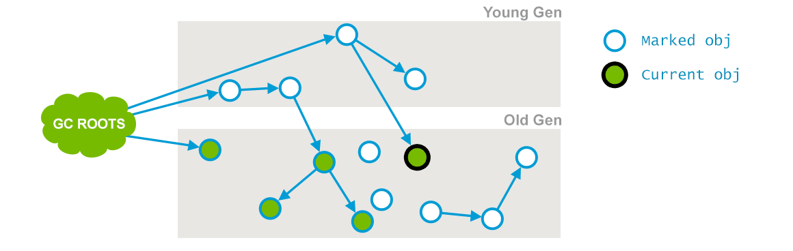

## CMS

- 收集器是一种以获取最短回收停顿时间为目标的收集器
- 算法：标记—清除
- 默认情况下在老年代使用了68%及以上的内存的时候就开始CMS。
- 老年代垃圾收集器

### 步骤

1. **初始标记（CMS initial mark）** 

   

   - 仅仅只是标记一下GCRoots能直接关联到的对象，**速度很快**；（一是标记老年代中所有的GC Roots所指的**直接对象**；二是标记被年轻代中存活对象引用的**直接对象**。）

   - 会**Stop the world**

2. **并发标记（CMS concurrent mark）**

   

   - 从GC Roots的直接关联对象开始遍历整个对象图的过程，**这个过程耗时较长**但是不需要停顿用户线程，可以与垃圾收集线程一起并发运行；
   - 在初始标记的基础上继续往下遍历其他的对象引用并进行标记，该过程会和用户线程**并发**地执行，不会发生停顿。这个阶段会从initial mark阶段中所标记的节点往下检索，标记出所有老年代中存活的对象。注意此时会有部分对象的引用被改变，如上图中的current obj原本所引用的节点已经失去了关联。

3. **重新标记（CMS remark）** 

   - 是为了修正并发标记期间，因用户程序继续运作而导致标记产生变动的那一部分对象的标记记录，这个阶段的停顿时间通常会比初始标记阶段稍长一些，但也远比并发标记阶段的时间短
   - 会**Stop the world**

4. **并发清除（CMS concurrent sweep）**

   - 清理删除掉标记阶段判断的已经死亡的对象，由于不需要移动存活对象，所以这个阶段也是可以与用户线程同时并发的

​	由于整个过程耗时最长的并发标记和并发清除过程，收集器都可以与用户线程一起工作，所以，从总体上来说，CMS收集器的内存回收过程是与用户线程并发进行的。

### 缺点

1. 对CPU资源敏感
2. 无法处理浮动垃圾（问题不大，留到下个GC过程再清理）
3. 标记-清除算法会产生内存碎片（可以通过调整+UseCMSCompactAtFullCollection参数来进行内存压缩整理）

