# 1. 概述

**其最大特点是暂停时间可配置**，我们可以配置一个最大暂停时间，G1就会尽可能的在回收的同时保证程序的暂停时间在允许范围内，而且在大内存环境下表现更好。

# 2. 概念

## mutator

在垃圾回收的里，mutator指应用程序。至于为什么叫这个奇怪的名字？

> mutator 是 Edsger Dijkstra 琢磨出来的词，有“改变某物”的意思。说到要改变什么，那就是 GC 对象间的引用关系。它的实体就是“应用程序”。GC 就是在这个mutator 内部精神饱满地 工作着。

## 增量垃圾回收

> 增量式垃圾回收（Incremental GC）是一种通过逐渐推进垃圾回收来控制mutator最 大暂停时间的方法。

- 像一些早期的年轻代垃圾回收器，都是完全暂停的，比如Serial GC。
- 简单的说，增量垃圾回收，就是让GC程序和Mutator交替运行的办法，交替执行时，实际上垃圾是一点点回收的，所以叫“增量（Incremental）”
- G1就属于一款增量垃圾回收器，它通过和mutator交替运行的方式来降低因GC导致的程序暂停时间

## Region

传统的GC收集器将连续的内存空间划分为新生代、老年代和永久代（JDK 8去除了永久代，引入了元空间Metaspace），这种划分的特点是各代的存储地址（逻辑地址，下同）**是连续**的。如下图所示：

而G1的各代存储地址是不连续的，每一代都使用了n个不连续的大小相同的Region，每个Region占有一块连续的虚拟内存地址。如下图所示：

在上图中，我们注意到还有一些Region标明了H，它代表Humongous，这表示这些Region存储的是巨大对象（humongous object，H-obj），即大小大于等于region一半的对象。H-obj有如下几个特征： 

- H-obj直接分配到了old gen，防止了反复拷贝移动。 
- H-obj在global concurrent marking阶段的cleanup 和 full GC阶段回收。
- 在分配H-obj之前先检查是否超过 initiating heap occupancy percent和the marking threshold, 如果超过的话，就启动global concurrent marking，为的是提早回收，防止 evacuation failures 和 full GC。

## SATB

全称是**Snapshot-At-The-Beginning**，是GC开始时活着的对象的一个快照。它是通过Root Tracing得到的，作用是维持并发GC的正确性。 那么它是怎么维持并发GC的正确性的呢？

根据**三色标记**算法，我们知道对象存在三种状态： 

- 白：对象没有被标记到，标记阶段结束后，会被当做垃圾回收掉。 

- 灰：对象被标记了，但是它的field还没有被标记或标记完。 

- 黑：对象被标记了，且它的所有field也被标记完了

  

## RSets

​		比如在对某个区域进行回收时，首先从GC ROOT开始遍历**可直达这些区域中**的对象，可由于**晋升或者移动的原因**，这些区域中的某些对象移动到了其他区域，**可是移动之后仍然保持着对原区域对象的引用**；那么此时原区域中被引用的对象**对GC ROOT来说**并不能“直达”，他们被其他对象的区域引用，这个发起引用的其他对象对于GC ROOT可达。这种情况下，如果想正确的标记这种GC ROOT不可直达但被其他区域引用的对象时就需要遍历所有区域了，代价太高。

​		如下图所示，如果此时堆区域A进行回收，那么需要标记区域A中所有存活的对象，可是A中有两个对象被其他区域引用，**这两个灰色的问号对象在区域A中对GC ROOTS来是不可达的**，但是实际上这两个对象的引用对象被GC ROOTS引用，所以这两个对象还是存活状态。此时如果不将这两个对象标记，那么就会导致标记的遗漏，可能造成误回收的问题。

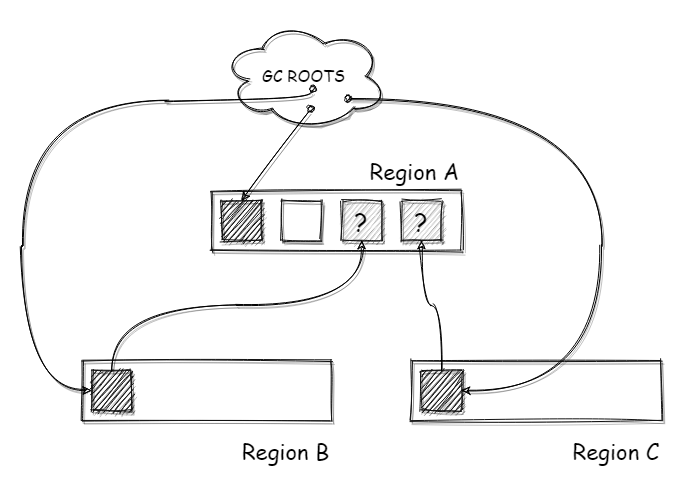

​		**RememberedSet（简称RS或RSet）**就是用来解决这个问题的，**RSet**会记录这种跨代引用的关系。在进行标记时，除了从GC ROOTS开始遍历，还会从RSet遍历，确保标记该区域所有存活的对象（其实不光是G1，其他的分代回收器里也有，比如CMS）。如下图所示，G1中利用一个RSet来记录这个跨区域引用的关系，**每个区域都有一个RSet**，用来记录这个跨区引用，这样在进行标记的时候，将RSet也作为ROOTS进行遍历即可

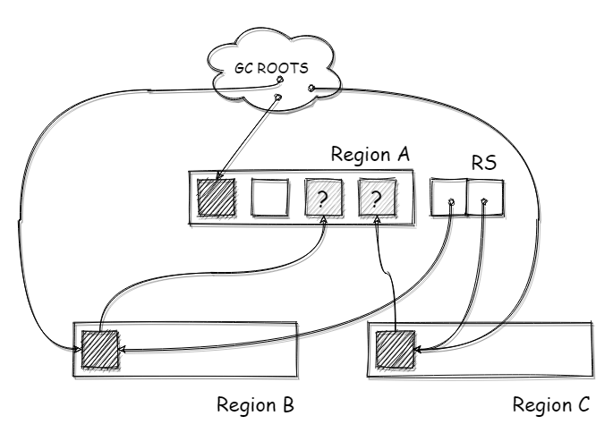

所以在对象晋升的时候，将晋升对象记录下来，这个存储跨区引用关系的容器称之为RSet，在G1中通过**Card Table**来实现。注意，这里说Card Table实现RSet，并不是说CardTable是RSet背后的数据结构，只是RSet中存储的是CardTable数据。

## Card Table

​		在G1 堆中，存在一个CardTable的数据，CardTable 是由元素为1B的数组来实现的，数组里的元素称之为卡片/卡页（Page）。这个CardTable会映射到整个堆的空间，每个卡片会对应堆中的**512B**空间。如下图所示，在一个大小为1GB的堆下，那么CardTable的长度为2097151 (1GB / 512B)；每个Region 大小为1 MB，每个Region都会对应2048个Card Page。
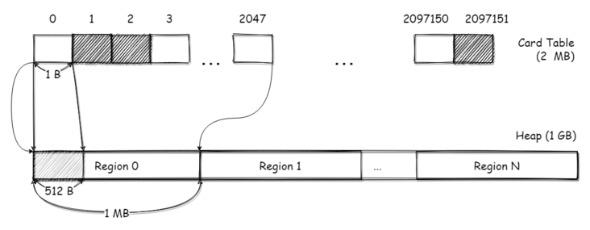

那么查找一个对象所在的CardPage只需要简单的计算就可以得出：

介绍完了CardTable，下面说说G1中RSet和CardTable如何配合工作。

​		每个区域中都有一个RSet，通过hash表实现，这个hash表的key是引用本区域的**其他区域**的地址，value是一个数组，数组的元素是**引用方的对象**所对应的Card Page在Card Table中的下标。如下图所示，区域B中的对象b引用了区域A中的对象a，这个引用关系跨了两个区域。b对象所在的CardPage为122，在区域A的RSet中，以区域B的地址作为key，b对象所在CardPage下标为value记录了这个引用关系，这样就完成了这个跨区域引用的记录。
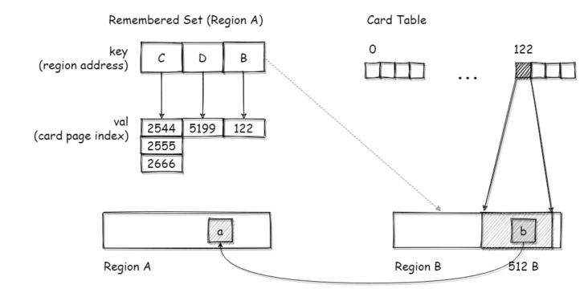

不过这个CardTable的粒度有点粗，毕竟一个CardPage有512B，在一个CardPage内可能会存在多个对象。所以在扫描标记时，需要扫描RSet中关联的整个CardPage

# 3. 步骤

1. **初始标记阶段 - Initial Marking Phase（STW）**

   - 存活对象的初始标记是捎带在新生代垃圾收集里面，在GC日志里被记录为`GC pause (young)(inital-mark)`

2. **并发标记阶段 - Concurrent Marking Phase**

   

   - 本阶段会与应用程序并发地查找存活的对象，如果找到了空的小堆区（下图中标记为红叉的），他们会在”重新标记阶段“被马上清除。还有决定了活跃度的”accounting“信息也是在本阶段计算的。

3. **重新标记阶段 - Remark Phase（STW）**

   - 对于G1，它短暂地停止应用线程，停止并发更新日志的写入，处理其中的少量信息，并标记所有在并发标记开始时未被标记的存活对象。这一阶段也执行某些额外的清理，如引用处理（参见 Evacuation Pause log）或者类卸载（class unloading）。空的小堆区被清除和回收，并且现在会计算所有小堆区的活跃度。

4. **复制/清除阶段 - Copying/Cleanup Phase（部分STW）**

# 4. GC 模式

## 4.1 YGC

- **完全年轻代GC是只选择年轻代区域（Eden/Survivor）进入回收集合（Collection Set，简称CSet）进行回收的模式。**年轻代GC的过程和其他的分代回收器差不多，新创建的对象分配至Eden区域，然后将标记存活的对象移动至Survivor区，达到晋升年龄的就晋升到老年代区域，然后清空原区域（不过这里可没有年轻代复制算法中两个Survivor的交换过程）。

- 年轻代GC会选择**所有的年轻代区域**加入回收集合中，但是为了满足用户停顿时间的配置，在每次GC后会调整这个最大年轻代区域的数量，每次回收的区域数量可能是变化的

  
  
  下面是一个完全年轻代GC过程的简单示意图：将选择的年轻代区域中所有存活的对象，移动至Survivor区域，然后清空原区域
  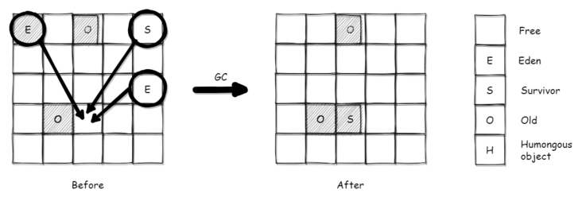

### 4.1.1 YGC 过程
​		当JVM无法将新对象分配到eden区域时，会触发年轻代的垃圾回收（年轻代垃圾回收是完全暂停的，虽然部分过程是并行，但暂停和并行并不冲突）。也会称为**“evacuation pause”**

####  步骤1. 选择收集集合（Choose CSet）

​		G1会在遵循用户设置的GC暂停时间上限的基础上，选择一个**最大年轻带区域数**，将这个数量的所有年轻代区域作为收集集合。如下图所示，此时A/B/C三个年轻代区域都已经作为收集集合，区域A中的A对象和区域B中的E对象，被ROOTS直接引用（图上为了简单，将RS直接引用到对象，实际上RS引用的是对象所在的CardPage）
  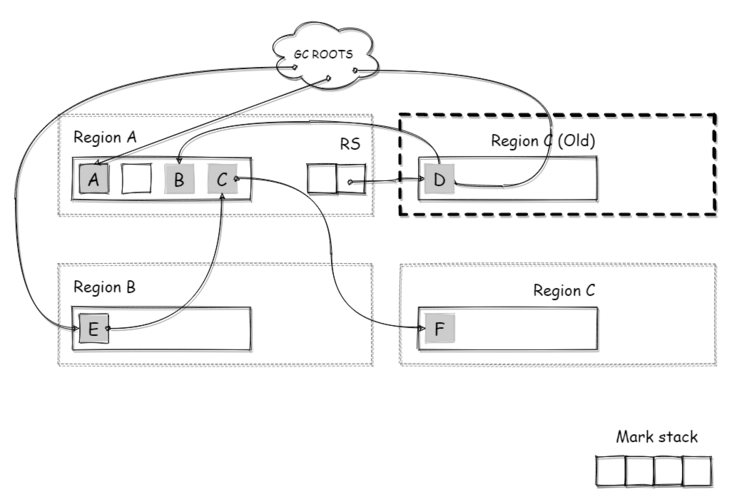

####   步骤2. 根处理（Root Scanning）

​		接下来，需要从GC ROOTS遍历，查找从ROOTS**直达到收集集合的对象，**移动他们到Survivor区域的同时将他们的引用对象加入标记栈。如下图所示，在根处理阶段，被GC ROOTS直接引用的A/E两个对象直接被复制到了Survivor区域M，同时A/E两个对象所**引用路线上的所有对象**，都被加入了标记栈（Mark Stack），这里包括E->C->F，这个F对象也会被加入标记栈中

  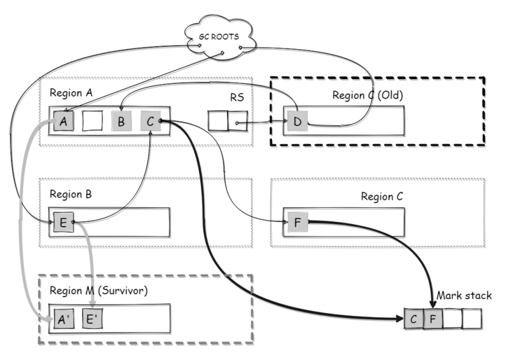

####  步骤3. RSet扫描（Scan RS）

- 将RSet作为ROOTS遍历，查找可直达到收集集合的对象，移动他们到Survivor区域的同时将他们的引用对象加入标记栈
- 在RSet扫描之前，还有一步更新RSet（Update RS）的步骤，因为RSet是先写日志，再通过一个Refine线程进行处理日志来维护RSet数据的，这里的更新RSet就是为了保证RSet日志被处理完成，RSet数据完整才可以进行扫描
- 如下图所示，老年代区域C中引用年轻代A的这个引用关系，被记录在年轻代的RSet中，此时遍历这个RS，将老年代C区域中D对象引用的年轻代A中的**B对象**，添加到标记栈中
    

####  步骤4. 移动（Evacuation/Object Copy）

遍历上面的标记栈，将栈内的所有所有的对象移动至Survivor区域（其实说是移动，本质上还是复制），如下图所示，标记栈中记录的C/F/B对象被移动到Survivor区域中  
  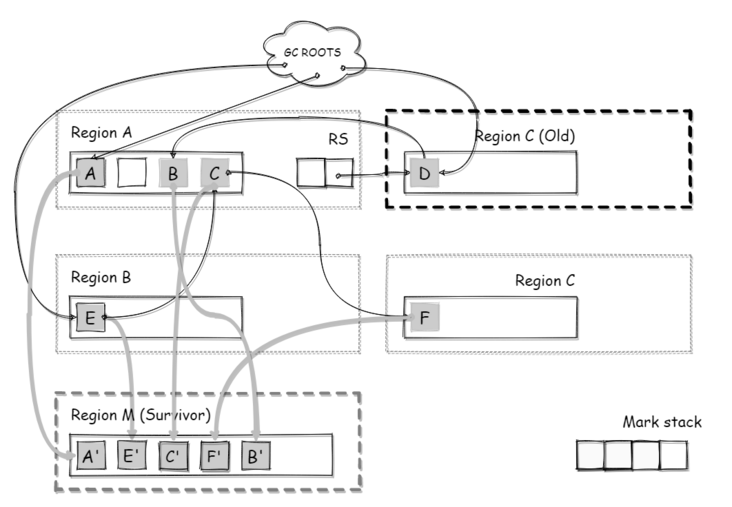

  当对象年龄超过晋升的阈值时，对象会直接移动到老年代区域，而不是Survivor区域。对象移动后，需要更新引用的指针

####  步骤5. 收尾步骤

​		剩下的就是一些收尾工作，Redirty（配合下面的并发标记）**，**Clear CT（清理Card Table），Free CSet（清理回收集合），清空移动前的区域添加到空闲区等等，这些操作一般耗时都很短

  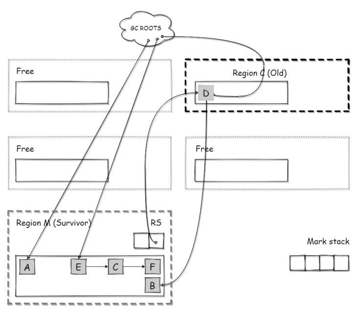

## 4.2 Mixed GC

​		**混合回收，也称部分年轻代GC，会选择<u>所有</u>年轻代区域（Eden/Survivor）（最大年轻代分区数）和<u>部分</u>老年代区域进去回收集合进行回收的模式。年轻代区域对象移动到Survivor区，老年代区域移动到老年代区域。**由于G1中老年代区域的回收方式和新生代一样是“移动式”，被回收区域在移动后会全部清空，所以不会像其他使用清除算法的回收器一样（比如CMS）有碎片问题。下面是一个部分年轻代GC过程的简单示意图：
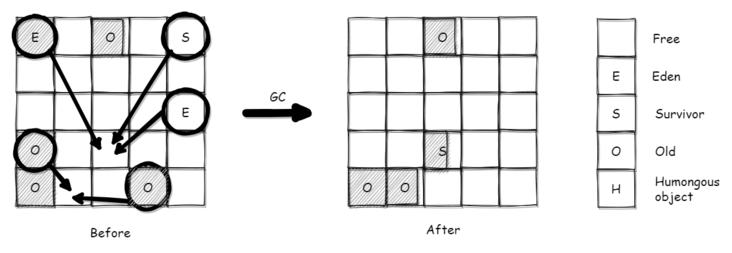

### 4.2.1 Mixed GC 过程

执行过程主要包含两步：

1. 并发标记（concurrent marking） - 增量式并发的标记存活对象，标记过程中Mutator的引用更新也会被标记
2. 移动/转移（evacuation）- 和年轻代的移动过程一致，复用代码，最大的不同是将并发标记的结果也进行处理

#### 并发标记

并发标记的目的是标记存活对象，为移动过程做准备。在并发标记的过程中，存活对象的标记和Mutator的运行是并发进行的。所以这个标记过程中引用变化的更新，是并发标记过程中最复杂的部分。

G1的并发标记设计，是基于CMS回收器的，所以整体标记过程和CMS中的并发标记很像。并发标记会对区域内所有的存活对象进行标记，那么未标记的对象就是垃圾需要回收（这里“并发”的目的是为了降低Mutator的暂停时间）

当老年代使用的内存加上本次即将分配的内存占到总内存的45%，就会启动混合回收，进行并发标记。

并发标记并不是直接在对象上进行标记，而是用了一个独立的数据容器 - 标记位图（MarkBitMap），统一的对区域中的所有对象进行标记，在移动时通过这个位图就可以判断对象是否存活

#### 标记位图

每个区域内都有两个标记位图（Mark Bitmap）：next和prev。next是本次标记的标记位图，而prev是上次标记的标记位图，保存上次标记的结果。

标记位图就是通过对象地址，映射到标记位图中的数据位，标记位图中的每一个bit都代表一个对象的标记状态，如下图所示：
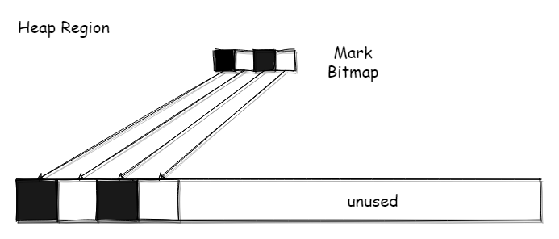

每个区域中，还有4个标记位置的指针，分别是bottom，top，nextTAMS，prevTAMS。由于是并发标记，标记的同时Mutator会分配对象、修改引用关系，而且并发标记（这里指的是并发**标记子阶段**）会被年轻代GC所中断，中断后继续就需要基于上次中断的点继续标记，所以这几个指针可以理解为记录变化点，有点游戏里暂存点的意思。

如下图所示 ，某个区域在进行标记前。bottom代表这个区域的底部，top表示区域内存的顶部（即使用量），TAMS（Top-at-Mark-Start，标记开始时的top），prevTAMS和nextTAMS即上/下一次的标记信息
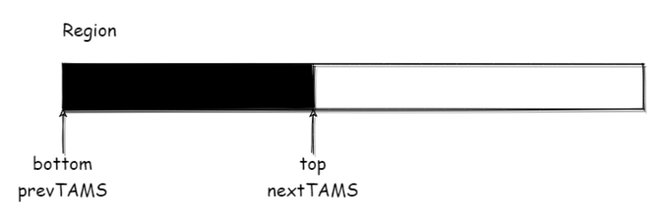

在标记时，如果该区域又分配了一些对象，那么top指针就会移动，那么此时**top-nextTAMS**就是标记过程中的新对象
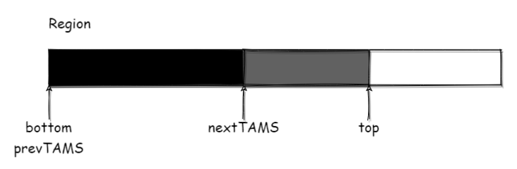

并发标记的过程分为以下几个步骤：

#### 初始标记（Initial Mark）

标记由根直接引用的对象（STW），这个过程是在年轻代GC中完成的，不过不是每次年轻代GC都会进行初始标记。

#### 并发标记（Concurrent Mark）

以步骤1的标记结果作为root，遍历可达的对象进行标记，和mutator并行，并且可被年轻代GC中断，年轻代GC完成后可继续进行标记

#### 最终标记 （Remark）

标记遗漏的对象，主要是SATB相关（STW）

#### 清理（Cleanup）

计算标记区域的活动对象数量，清理没有存活对象的区域（标记后没有存活对象，并不是正经的回收阶段），对区域排序等**（部分STW）**

#### 混合收集

这里的混合收集，是指混合回收GC下的回收过程。在并发标记完成后，就可以进行混合收集了（mixed），混合收集阶段和年轻代GC一致，从并发标记的结果/ROOTS/RSet遍历回收存活对象即可，只是多了老年代区域的回收

## 4.3 Full GC

​		当混合回收无法跟上内存分配的速度，导致老年代也满了，就会进行Full GC对整个堆进行回收。G1中的Full GC也而是单线程串行的，而且是全暂停，使用的是标记-整理算法，代价非常高。

# 5. 其他

## 暂停时间的控制

​		G1在移动过程中虽然也是全暂停，不过G1在选择回收集合上是变化的，每次只选择部分的区域进行回收，通过计算每个区域的预测暂停时间来保证每次回收所占用的时间。简单的说就是将一次完整的GC拆分成多次短时间的GC从而降低暂停的时间，尽量保证每次的暂停时间在用户的配置范围（-XX:MaxGCPauseMilli）内。

## 年轻代大小的配置

​		G1为了控制暂停时间，年轻代最大区域数是动态调整的，不过如果手动设置了年轻代大小，比如Xmn/MaxNewSize/NewRatio等，并且年轻代最大和最小值一样，那么相当于禁用了这个最大区域数调整的功能，可能会导致暂停时间控制的失效（因为年轻代GC是选择全部区域的，区域过多会导致暂停时间的增加）。**所以G1中尽量不要设置年轻代的大小，让G1自动的进行调整**

# Refer

>https://tech.meituan.com/2016/09/23/g1.html
>
>https://blog.chriscs.com/2017/06/20/g1-vs-cms/
>
>https://segmentfault.com/a/1190000039411521

