# 1. 概述

**其最大特点是暂停时间可配置**，我们可以配置一个最大暂停时间，G1就会尽可能的在回收的同时保证程序的暂停时间在允许范围内，而且在大内存环境下表现更好。

- 虽然G1仍然保留新生代和老年代的概念，但新生代和老年代不再是固定的了，它们都是一系列区 域(不需要连续)的动态集合。G1收集器之所以能建立可预测的停顿时间模型，是因为它将Region作 为单次回收的最小单元，即每次收集到的内存空间都是Region大小的整数倍，这样可以有计划地避免 在整个Java堆中进行全区域的垃圾收集。更具体的处理思路是让G1收集器去跟踪各个Region里面的垃圾堆积的“价值”大小，价值即回收所获得的空间大小以及回收所需时间的经验值，然后在后台维护一个优先级列表，每次根据用户设定允许的收集停顿时间(使用参数-XX:MaxGCPauseMillis指定，默认值是200毫秒)，优先处理回收价值收益最大的那些Region，这也就是“Garbage First”名字的由来。 这种使用Region划分内存空间，以及具有优先级的区域回收方式，保证了G1收集器在有限的时间内获取尽可能高的收集效率。

  

> 当执行垃圾回收时，G1操作的方式类似于CMS，G1执行并发的全局标记阶段来确定堆上的对象是否存活，标记阶段完成后，G1就知道哪些region回收的收益最大（也就是垃圾最多），它会优先回收这些region，从而产生大量的空闲空间。这就是为什么这种垃圾收集方法叫做G1（垃圾优先）。就如收集器名称所暗示的那样，G1将回收和压缩活动专注于那些可能充满了可回收对象的堆区域中。
>
> G1使用GC停顿可预测模型，来满足用户设定的GC停顿时间，根据用户设定的目标时间（**默认200ms**），G1决定清除哪些region，清除多少region。
>
> G1认为可回收的区域通过一种叫做“撤离”的方式进行垃圾回收，G1从一个或多个region中复制对象到一个region中，这个过程中G1会压缩和释放内存。处于减小停顿时间和提升吞吐量的目的，这种方式的回收是多核并行进行的。从而随着每次的GC，G1都会在用户规定的停顿时间范围内持续地降低碎片化程度（因为是copy算法，另外还有压缩）。这种方式高于之前的垃圾收集方法：CMS不会压缩，而ParallelOld只会整堆压缩，无疑这会造成相当长的停顿时间。
>
> G1并不是一个实时的垃圾收集器，它会尽可能地去将停顿时间控制在用户设定的时间范围内，但是无法保证绝对。基于前几次回收的数据，G1会估算在用户指定的目标时间内能回收多少region，因此G1对于回收region的开销有一个比较合理准确的模型供参考，它就是用这个模型来决定在用户规定时间内回收多少region。


# 2. 概念

## mutator

在垃圾回收的里，mutator指应用程序。至于为什么叫这个奇怪的名字？

> mutator 是 Edsger Dijkstra 琢磨出来的词，有“改变某物”的意思。说到要改变什么，那就是 GC 对象间的引用关系。它的实体就是“应用程序”。GC 就是在这个mutator 内部精神饱满地 工作着。


## 增量垃圾回收

> 增量式垃圾回收（Incremental GC）是一种通过逐渐推进垃圾回收来控制mutator最 大暂停时间的方法。

- 像一些早期的年轻代垃圾回收器，都是完全暂停的，比如Serial GC。
- 简单的说，增量垃圾回收，就是让GC程序和Mutator交替运行的办法，交替执行时，实际上垃圾是一点点回收的，所以叫“增量（Incremental）”
- G1就属于一款增量垃圾回收器，它通过和mutator交替运行的方式来降低因GC导致的程序暂停时间

## Region

传统的GC收集器将连续的内存空间划分为新生代、老年代和永久代（JDK 8去除了永久代，引入了元空间Metaspace），这种划分的特点是各代的存储地址（逻辑地址，下同）**是连续**的。如下图所示：


而G1的各代存储地址是不连续的，每一代都使用了n个不连续的大小相同的Region，每个Region占有一块连续的虚拟内存地址。如下图所示：


在上图中，我们注意到还有一些Region标明了H，它代表Humongous，这表示这些Region存储的是巨大对象（**humongous object**，H-obj），即**大小大于等于region一半的对象**。H-obj有如下几个特征： 

- H-obj直接分配到了old gen，防止了反复拷贝移动。 
- H-obj在global concurrent marking阶段的cleanup 和 full GC阶段回收。
- 在分配H-obj之前先检查是否超过 initiating heap occupancy percent和the marking threshold, 如果超过的话，就启动global concurrent marking，为的是提早回收，防止 evacuation failures 和 full GC。

## SATB

全称是**Snapshot-At-The-Beginning**，是GC开始时活着的对象的一个快照。它是通过Root Tracing得到的，作用是维持并发GC的正确性。 那么它是怎么维持并发GC的正确性的呢？

根据**三色标记**算法，我们知道对象存在三种状态： 

- 白：对象没有被标记到，标记阶段结束后，会被当做垃圾回收掉。 

- 灰：对象被标记了，但是它的field还没有被标记或标记完。 

- 黑：对象被标记了，且它的所有field也被标记完了

  

## RSets（Remembered Sets)

​		比如在对某个区域进行回收时，首先从GC ROOT开始遍历**可直达这些区域中**的对象，可由于**晋升或者移动的原因**，这些区域中的某些对象移动到了其他区域，**可是移动之后仍然保持着对原区域对象的引用**；那么此时原区域中被引用的对象**对GC ROOT来说**并不能“直达”，他们被其他对象的区域引用，这个发起引用的其他对象对于GC ROOT可达。这种情况下，如果想正确的标记这种GC ROOT不可直达但被其他区域引用的对象时就需要遍历所有区域了，代价太高。

​		如下图所示，如果此时堆区域A进行回收，那么需要标记区域A中所有存活的对象，可是A中有两个对象被其他区域引用，**这两个灰色的问号对象在区域A中对GC ROOTS来是不可达的**，但是实际上这两个对象的引用对象被GC ROOTS引用，所以这两个对象还是存活状态。此时如果不将这两个对象标记，那么就会导致标记的遗漏，可能造成误回收的问题。

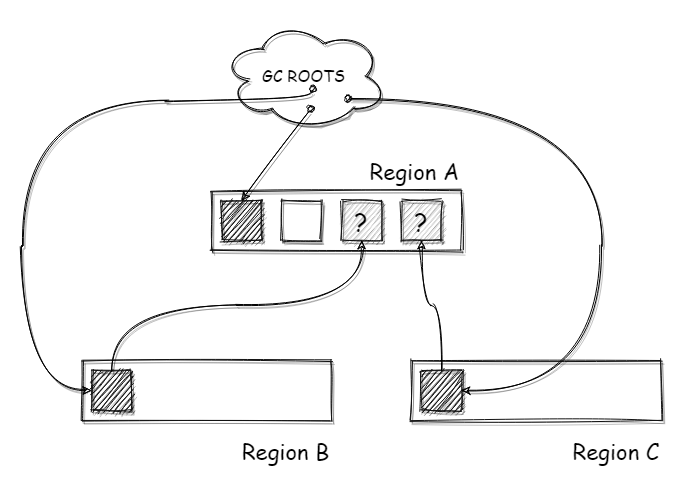

​		**RememberedSet（简称RS或RSet）**就是用来解决这个问题的，**RSet**会记录这种跨代引用的关系。在进行标记时，除了从GC ROOTS开始遍历，还会从RSet遍历，确保标记该区域所有存活的对象（其实不光是G1，其他的分代回收器里也有，比如CMS）。如下图所示，G1中利用一个RSet来记录这个跨区域引用的关系，**每个区域都有一个RSet**，用来记录这个跨区引用，这样在进行标记的时候，将RSet也作为ROOTS进行遍历即可

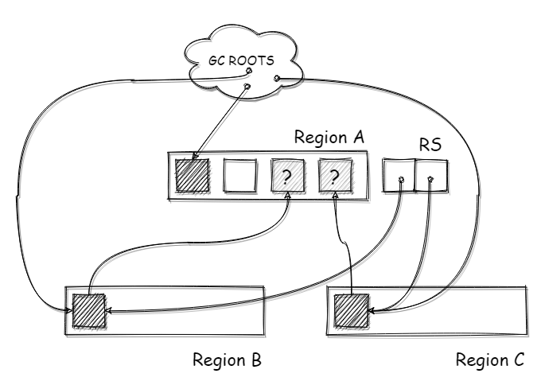

所以在对象晋升的时候，将晋升对象记录下来，这个存储跨区引用关系的容器称之为RSet，在G1中通过**Card Table**来实现。注意，这里说Card Table实现RSet，并不是说CardTable是RSet背后的数据结构，只是RSet中存储的是CardTable数据。


## CSets（Collection Sets）

在G1中，一组在GC中会被回收的region集合。CSets中所有仍存活的对象在GC中会被“撤离”，就是被移动或者拷贝到另一个region中，CSets中的region角色是不固定的，可以使Eden，Survivor，Old Generation，都可以。CSets对JVM size大小的影响小于1%。


## Card Table

​		在G1 堆中，存在一个CardTable的数据，CardTable 是由元素为1B的数组来实现的，数组里的元素称之为卡片/卡页（Page）。这个CardTable会映射到整个堆的空间，每个卡片会对应堆中的**512B**空间。如下图所示，在一个大小为1GB的堆下，那么CardTable的长度为2097151 (1GB / 512B)；每个Region 大小为1 MB，每个Region都会对应2048个Card Page。
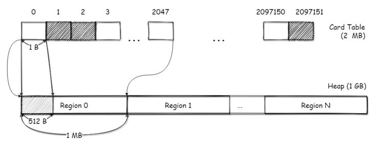

那么查找一个对象所在的CardPage只需要简单的计算就可以得出：


介绍完了CardTable，下面说说G1中RSet和CardTable如何配合工作。

​		每个区域中都有一个RSet，通过hash表实现，这个hash表的key是引用本区域的**其他区域**的地址，value是一个数组，数组的元素是**引用方的对象**所对应的Card Page在Card Table中的下标。如下图所示，区域B中的对象b引用了区域A中的对象a，这个引用关系跨了两个区域。b对象所在的CardPage为122，在区域A的RSet中，以区域B的地址作为key，b对象所在CardPage下标为value记录了这个引用关系，这样就完成了这个跨区域引用的记录。
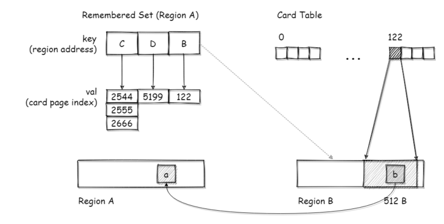

不过这个CardTable的粒度有点粗，毕竟一个CardPage有512B，在一个CardPage内可能会存在多个对象。所以在扫描标记时，需要扫描RSet中关联的整个CardPage

## IHOP

The Initiating Heap Occupancy Percent, 


## TAMS(Top at Mark Start)

​			譬如，在并发标记阶段如何保证收集线程与用户线程互不干扰地运行? 这里首先要解决的是用户线程改变对象引用关系时，必须保证其不能打破原本的对象图结构，导致标记结果出现错误，而G1 收集器则是通过原始快照(SATB)算法来实现的。此外，垃圾收集对用户线程的影响还体现在回收过程中新创建对象的内存分配上，程序要继续运行就肯定会持续有新对象被创建，G1为每一个Region设计了两个名为**TAMS(Top at Mark Start)的指针**，把Region中的一部分空间划分出来用于并发回收过 程中的新对象分配，并发回收时新分配的对象地址都必须要在这两个指针位置以上。G1收集器默认在 这个地址以上的对象是被隐式标记过的，即默认它们是存活的，不纳入回收范围。与CM S中 的“Concurrent M ode Failure”失败会导致Full GC类似，如果内存回收的速度赶不上内存分配的速度， G1收集器也要被迫冻结用户线程执行，导致Full GC而产生长时间“Stop The World”。


# 3. 步骤


## 1. 初始标记阶段 - Initial Marking Phase(STW)

   - 仅仅只是标记一下GC Roots能直接关联到的对象，并且修改TAMS 指针的值，让下一阶段用户线程并发运行时，能正确地在可用的Region中分配新对象。这个阶段需要停顿线程，但耗时很短，而且是借用进行Minor GC的时候同步完成的，所以G1收集器在这个阶段实际并没有额外的停顿
   - 存活对象的初始标记是捎带在新生代垃圾收集里面，在GC日志里被记录为`GC pause (young)(inital-mark)`


## 2. 并发标记阶段 - Concurrent Marking Phase

   

   - 从GC Root开始对堆中对象进行可达性分析，递归扫描整个堆 里的对象图，找出要回收的对象，这阶段耗时较长，但可与用户程序并发执行。
   - 当对象图扫描完成以后，还要重新处理SATB记录下的在并发时有引用变动的对象。


## 3. 重新标记阶段 - Remark Phase（STW）

   - 对于G1，它短暂地停止应用线程，停止并发更新日志的写入，处理其中的少量信息，并标记所有在并发标记开始时未被标记的存活对象。这一阶段也执行某些额外的清理，如引用处理（参见 Evacuation Pause log）或者类卸载（class unloading）。空的小堆区被清除和回收，并且现在会计算所有小堆区的活跃度。
   - 对用户线程做另一个短暂的暂停，用于处理并发阶段结束后仍遗留 下来的最后那少量的SAT B记录。


## 4. 复制/清除阶段 - Copying/Cleanup Phase（STW）

- 负责更新Region的统计数据，对各个Region的回收价值和成本进行排序，根据用户所期望的停顿时间来制定回收计划，可以自由选择任意多个Region 构成回收集，然后把决定回收的那一部分Region的存活对象复制到空的Region中，再清理掉整个旧 Region的全部空间。这里的操作涉及存活对象的移动，是必须暂停用户线程，由多条收集器线程并行完成的。


​		从上述阶段的描述可以看出，**G1收集器除了并发标记外，其余阶段也是要完全暂停用户线程的**， 换言之，它并非纯粹地追求低延迟，官方给它设定的目标是在延迟可控的情况下获得尽可能高的吞吐量，所以才能担当起“全功能收集器”的重任与期望。

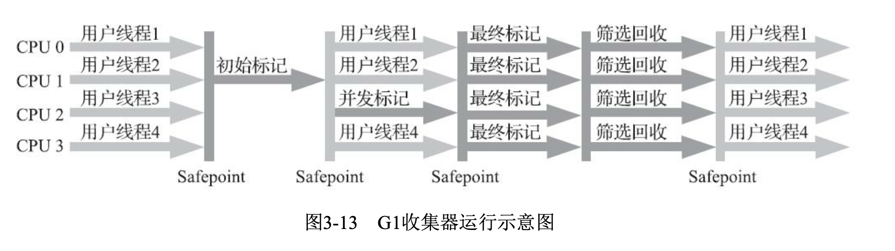

# 4. GC 模式

## 4.0 Young-only 阶段

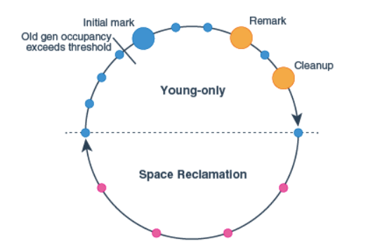


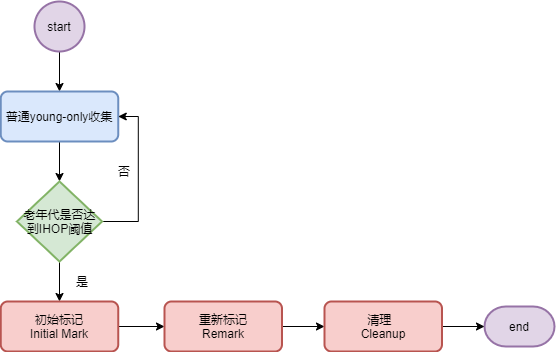


这个阶段从普通的 young-only GC 开始，young-only GC把一些对象移动到老年代，当老年代的空间占用达到IHOP时，G1就停止普通的young-only GC，开始初始标记(Initial Mark)。

- 初始标记：这个过程除了普通的 young-only GC 外，还会开始并发标记过程，这个过程决定了被标记的老年代存活对象在下一次space-reclamation阶段会被保留。这个过程不会STW，有可能标记还没有结束普通的 young-only GC 就开始了。这个标记过程需要在重新标记(Remark)和清理(Cleanup)两个过程后才能结束。
- 重新标记: 这个过程会STW，这个过程做全局引用和类卸载。
- 在重新标记和清理这两个阶段之间G1会并发计算对象存活信息，这个信息用于清理阶段更新内部数据结构。
- 清理阶段：这个节点回收所有的空闲区域，并且决定是否接着执行一次space-reclamation，如果是，则仅仅执行一次单独的young-only GC，young-only阶段就结束了。


在young-only阶段，要回收新生代的region。每一次 young-only 结束的时候，G1总是会调整新生代大小。G1可以使用参数 -XX:MaxGCPauseTimeMillis和 -XX:PauseTimeIntervalMillis 来设置目标停顿时间，这两个参数是对实际停顿时间的长期观察得来的。他会根据在GC的时候要拷贝多少个对象，对象之间是如何相互关联的等信息计算出来回收相同大小的新生代内存需要花费多少时间，

如果没有其他的限定条件，G1会把young区的大小调整为 -XX:G1NewSizePercent和 -XX:G1MaxNewSizePercent 之间的值来满足停顿时间的要求


## 4.1 YGC

- **完全年轻代GC是只选择年轻代区域（Eden/Survivor）进入回收集合（Collection Set，简称CSet）进行回收的模式。**年轻代GC的过程和其他的分代回收器差不多，新创建的对象分配至Eden区域，然后将标记存活的对象移动至Survivor区，达到晋升年龄的就晋升到老年代区域，然后清空原区域（不过这里可没有年轻代复制算法中两个Survivor的交换过程）。

- 年轻代GC会选择**所有的年轻代区域**加入回收集合中，但是为了满足用户停顿时间的配置，在每次GC后会调整这个最大年轻代区域的数量，每次回收的区域数量可能是变化的

  
  
  下面是一个完全年轻代GC过程的简单示意图：将选择的年轻代区域中所有存活的对象，移动至Survivor区域，然后清空原区域
  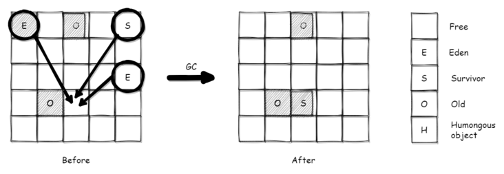

### 4.1.1 YGC 过程
​		当JVM无法将新对象分配到eden区域时，会触发年轻代的垃圾回收（年轻代垃圾回收是完全暂停的，虽然部分过程是并行，但暂停和并行并不冲突）。也会称为**“evacuation pause”**

####  步骤1. 选择收集集合（Choose CSet）

​		G1会在遵循用户设置的GC暂停时间上限的基础上，选择一个**最大年轻带区域数**，将这个数量的所有年轻代区域作为收集集合。如下图所示，此时A/B/C三个年轻代区域都已经作为收集集合，区域A中的A对象和区域B中的E对象，被ROOTS直接引用（图上为了简单，将RS直接引用到对象，实际上RS引用的是对象所在的CardPage）
  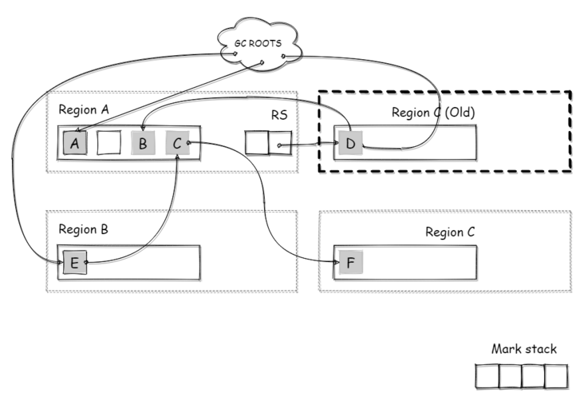

####   步骤2. 根处理（Root Scanning）

​		接下来，需要从GC ROOTS遍历，查找从ROOTS**直达到收集集合的对象，**移动他们到Survivor区域的同时将他们的引用对象加入标记栈。如下图所示，在根处理阶段，被GC ROOTS直接引用的A/E两个对象直接被复制到了Survivor区域M，同时A/E两个对象所**引用路线上的所有对象**，都被加入了标记栈（Mark Stack），这里包括E->C->F，这个F对象也会被加入标记栈中

  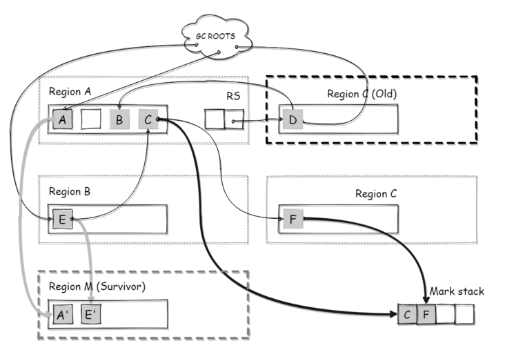


####  步骤3. RSet扫描（Scan RS）

- 将RSet作为ROOTS遍历，查找可直达到收集集合的对象，移动他们到Survivor区域的同时将他们的引用对象加入标记栈
- 在RSet扫描之前，还有一步更新RSet（Update RS）的步骤，因为RSet是先写日志，再通过一个Refine线程进行处理日志来维护RSet数据的，这里的更新RSet就是为了保证RSet日志被处理完成，RSet数据完整才可以进行扫描
- 如下图所示，老年代区域C中引用年轻代A的这个引用关系，被记录在年轻代的RSet中，此时遍历这个RS，将老年代C区域中D对象引用的年轻代A中的**B对象**，添加到标记栈中
    


####  步骤4. 移动（Evacuation/Object Copy）

遍历上面的标记栈，将栈内的所有所有的对象移动至Survivor区域（其实说是移动，本质上还是复制），如下图所示，标记栈中记录的C/F/B对象被移动到Survivor区域中  
  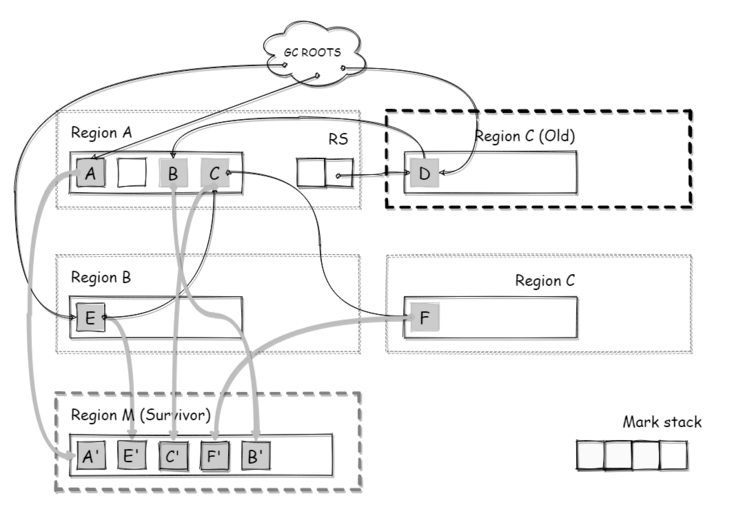

  当对象年龄超过晋升的阈值时，对象会直接移动到老年代区域，而不是Survivor区域。对象移动后，需要更新引用的指针


####  步骤5. 收尾步骤

​		剩下的就是一些收尾工作，Redirty（配合下面的并发标记）**，**Clear CT（清理Card Table），Free CSet（清理回收集合），清空移动前的区域添加到空闲区等等，这些操作一般耗时都很短

  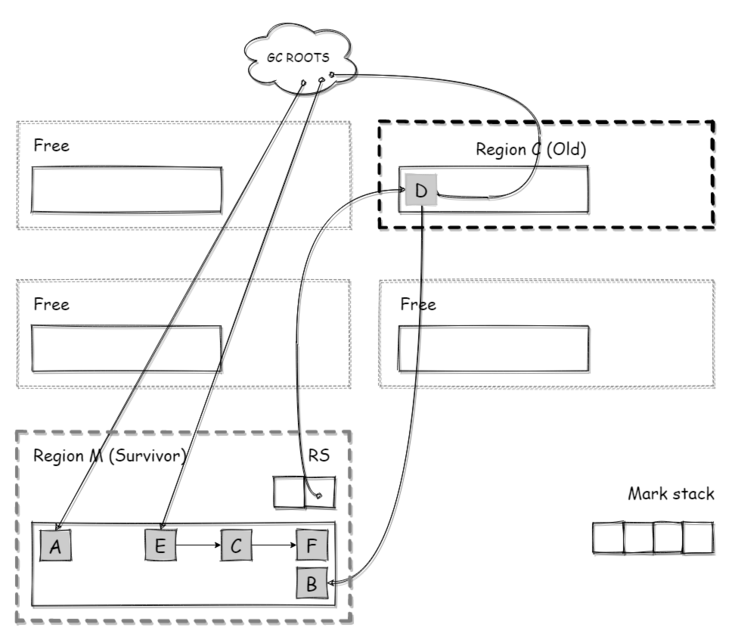


## 4.2 Mixed GC

​		**混合回收，也称部分年轻代GC，会选择<u>所有</u>年轻代区域（Eden/Survivor）（最大年轻代分区数）和<u>部分</u>老年代区域进去回收集合进行回收的模式。年轻代区域对象移动到Survivor区，老年代区域移动到老年代区域。**由于G1中老年代区域的回收方式和新生代一样是“移动式”，被回收区域在移动后会全部清空，所以不会像其他使用清除算法的回收器一样（比如CMS）有碎片问题。下面是一个部分年轻代GC过程的简单示意图：


### 4.2.1 Mixed GC 过程

执行过程主要包含两步：

1. 并发标记（concurrent marking） - 增量式并发的标记存活对象，标记过程中Mutator的引用更新也会被标记
2. 移动/转移（evacuation）- 和年轻代的移动过程一致，复用代码，最大的不同是将并发标记的结果也进行处理

#### 并发标记

并发标记的目的是标记存活对象，为移动过程做准备。在并发标记的过程中，存活对象的标记和Mutator的运行是并发进行的。所以这个标记过程中引用变化的更新，是并发标记过程中最复杂的部分。

G1的并发标记设计，是基于CMS回收器的，所以整体标记过程和CMS中的并发标记很像。并发标记会对区域内所有的存活对象进行标记，那么未标记的对象就是垃圾需要回收（这里“并发”的目的是为了降低Mutator的暂停时间）

当老年代使用的内存加上本次即将分配的内存占到总内存的45%，就会启动混合回收，进行并发标记。

并发标记并不是直接在对象上进行标记，而是用了一个独立的数据容器 - 标记位图（MarkBitMap），统一的对区域中的所有对象进行标记，在移动时通过这个位图就可以判断对象是否存活

#### 标记位图

每个区域内都有两个标记位图（Mark Bitmap）：next和prev。next是本次标记的标记位图，而prev是上次标记的标记位图，保存上次标记的结果。

标记位图就是通过对象地址，映射到标记位图中的数据位，标记位图中的每一个bit都代表一个对象的标记状态，如下图所示：
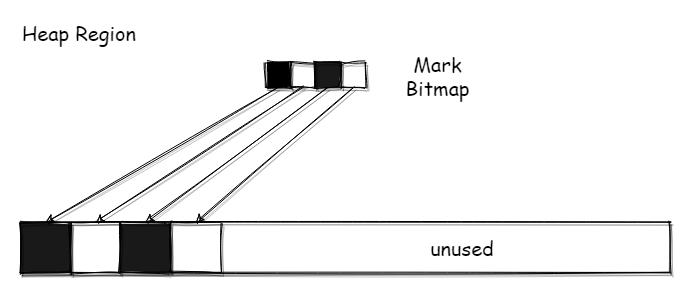

每个区域中，还有4个标记位置的指针，分别是bottom，top，nextTAMS，prevTAMS。由于是并发标记，标记的同时Mutator会分配对象、修改引用关系，而且并发标记（这里指的是并发**标记子阶段**）会被年轻代GC所中断，中断后继续就需要基于上次中断的点继续标记，所以这几个指针可以理解为记录变化点，有点游戏里暂存点的意思。

如下图所示 ，某个区域在进行标记前。bottom代表这个区域的底部，top表示区域内存的顶部（即使用量），TAMS（Top-at-Mark-Start，标记开始时的top），prevTAMS和nextTAMS即上/下一次的标记信息
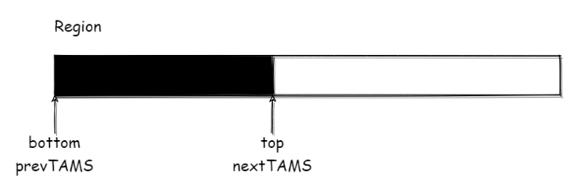

在标记时，如果该区域又分配了一些对象，那么top指针就会移动，那么此时**top-nextTAMS**就是标记过程中的新对象
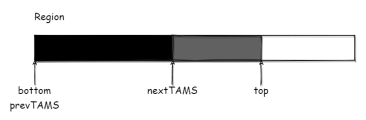


并发标记的过程分为以下几个步骤：

#### 初始标记（Initial Mark）

标记由根直接引用的对象（STW），这个过程是在年轻代GC中完成的，不过不是每次年轻代GC都会进行初始标记。

#### 并发标记（Concurrent Mark）

以步骤1的标记结果作为root，遍历可达的对象进行标记，和mutator并行，并且可被年轻代GC中断，年轻代GC完成后可继续进行标记

#### 最终标记 （Remark）

标记遗漏的对象，主要是SATB相关（STW）

#### 清理（Cleanup）

计算标记区域的活动对象数量，清理没有存活对象的区域（标记后没有存活对象，并不是正经的回收阶段），对区域排序等**（部分STW）**

#### 混合收集

这里的混合收集，是指混合回收GC下的回收过程。在并发标记完成后，就可以进行混合收集了（mixed），混合收集阶段和年轻代GC一致，从并发标记的结果/ROOTS/RSet遍历回收存活对象即可，只是多了老年代区域的回收


## 4.3 Full GC

​		当混合回收无法跟上内存分配的速度，导致老年代也满了，就会进行Full GC对整个堆进行回收。G1中的Full GC也而是单线程串行的，而且是全暂停，使用的是标记-整理算法，代价非常高。


# 5. 重要的默认值

G1 GC 是自适应的垃圾回收器，提供了若干默认设置，使其无需修改即可高效地工作。以下是重要选项及其默认值的列表。此列表适用于最新的 Java HotSpot VM build 24。您可以通过在 JVM 命令行输入下列选项和已更改的设置，根据您的应用程序性能需求调整和调优 G1 GC。

- ```
  -XX:G1HeapRegionSize=n
  ```

  设置的 G1 区域的大小。值是 2 的幂，范围是 1 MB 到 32 MB 之间。目标是根据最小的 Java 堆大小划分出约 2048 个区域。

- ```
  -XX:MaxGCPauseMillis=200
  ```

  为所需的最长暂停时间设置目标值。默认值是 200 毫秒。指定的值不适用于您的堆大小。

- ```
  -XX:G1NewSizePercent=5
  ```

  设置要用作年轻代大小最小值的堆百分比。默认值是 Java 堆的 5%。这是一个实验性的标志。有关示例，请参见“[如何解锁实验性虚拟机标志](https://www.oracle.com/cn/technical-resources/articles/java/g1gc.html)”。此设置取代了 -XX:DefaultMinNewGenPercent 设置。Java HotSpot VM build 23 中没有此设置。

- ```
  -XX:G1MaxNewSizePercent=60
  ```

  设置要用作年轻代大小最大值的堆大小百分比。默认值是 Java 堆的 60%。这是一个实验性的标志。有关示例，请参见“[如何解锁实验性虚拟机标志](https://www.oracle.com/cn/technical-resources/articles/java/g1gc.html)”。此设置取代了 -XX:DefaultMaxNewGenPercent 设置。Java HotSpot VM build 23 中没有此设置。

- ```
  -XX:ParallelGCThreads=n
  ```

  设置 STW 工作线程数的值。将 n 的值设置为逻辑处理器的数量。n 的值与逻辑处理器的数量相同，最多为 8。

  如果逻辑处理器不止八个，则将 n 的值设置为逻辑处理器数的 5/8 左右。这适用于大多数情况，除非是较大的 SPARC 系统，其中 n 的值可以是逻辑处理器数的 5/16 左右。

- ```
  -XX:ConcGCThreads=n
  ```

  设置并行标记的线程数。将 n 设置为并行垃圾回收线程数 (ParallelGCThreads) 的 1/4 左右。

- ```
  -XX:InitiatingHeapOccupancyPercent=45
  ```

  设置触发标记周期的 Java 堆占用率阈值。默认占用率是整个 Java 堆的 45%。

- ```
  -XX:G1MixedGCLiveThresholdPercent=65
  ```

  为混合垃圾回收周期中要包括的旧区域设置占用率阈值。默认占用率为 65%。这是一个实验性的标志。有关示例，请参见“[如何解锁实验性虚拟机标志](https://www.oracle.com/cn/technical-resources/articles/java/g1gc.html)”。此设置取代了 -XX:G1OldCSetRegionLiveThresholdPercent 设置。Java HotSpot VM build 23 中没有此设置。

- ```
  -XX:G1HeapWastePercent=10
  ```

  设置您愿意浪费的堆百分比。如果可回收百分比小于堆废物百分比，Java HotSpot VM 不会启动混合垃圾回收周期。默认值是 10%。Java HotSpot VM build 23 中没有此设置。

- ```
  -XX:G1MixedGCCountTarget=8
  ```

  设置标记周期完成后，对存活数据上限为 G1MixedGCLIveThresholdPercent 的旧区域执行混合垃圾回收的目标次数。默认值是 8 次混合垃圾回收。混合回收的目标是要控制在此目标次数以内。Java HotSpot VM build 23 中没有此设置。

- ```
  -XX:G1OldCSetRegionThresholdPercent=10
  ```

  设置混合垃圾回收期间要回收的最大旧区域数。默认值是 Java 堆的 10%。Java HotSpot VM build 23 中没有此设置。

- ```
  -XX:G1ReservePercent=10
  ```

  设置作为空闲空间的预留内存百分比，以降低目标空间溢出的风险。默认值是 10%。增加或减少百分比时，请确保对总的 Java 堆调整相同的量。Java HotSpot VM build 23 中没有此设置。

### 如何解锁实验性虚拟机标志

要更改实验性标志的值，必须先对其解锁。解锁方法是：在命令行中的实验性标志前，显式地设置 -XX:+UnlockExperimentalVMOptions。例如：

```
> java -XX:+UnlockExperimentalVMOptions -XX:G1NewSizePercent=10 -XX:G1MaxNewSizePercent=75 G1test.jar
```

## 5.1. 建议

评估和微调 G1 GC 时，请记住以下建议：

- **年轻代大小**：避免使用 -Xmn 选项或 -XX:NewRatio 等其他相关选项显式设置年轻代大小。固定年轻代的大小会覆盖暂停时间目标。

- **暂停时间目标**：每当对垃圾回收进行评估或调优时，都会涉及到延迟与吞吐量的权衡。G1 GC 是增量垃圾回收器，暂停统一，同时应用程序线程的开销也更多。G1 GC 的吞吐量目标是 90% 的应用程序时间和 10%的垃圾回收时间。如果将其与 Java HotSpot VM 的吞吐量回收器相比较，目标则是 99% 的应用程序时间和 1% 的垃圾回收时间。因此，当您评估 G1 GC 的吞吐量时，暂停时间目标不要太严苛。目标太过严苛表示您愿意承受更多的垃圾回收开销，而这会直接影响到吞吐量。当您评估 G1 GC 的延迟时，请设置所需的（软）实时目标，G1 GC 会尽量满足。副作用是，吞吐量可能会受到影响。

- 掌握混合垃圾回收：当您调优混合垃圾回收时，请尝试以下选项。有关这些选项的信息，请参见“重要的默认值”：

  - `-XX:InitiatingHeapOccupancyPercent` 用于更改标记阈值。
  - `-XX:G1MixedGCLiveThresholdPercent 和 -XX:G1HeapWastePercent` 当您想要更改混合垃圾回收决定时。
  - `-XX:G1MixedGCCountTarget 和 -XX:G1OldCSetRegionThresholdPercent` 当您想要调整旧区域的 CSet 时。


# 6. 其他

## 怎样建立起可靠的停顿预测模型?

​		用户通过 `-XX:MaxGCPauseMillis` 参数指定的停顿时间只意味着垃圾收集发生之前的期望值，但G1收集器要怎么做才能满足用户的期望呢? 

​		G1收集器的停顿预测模型是**以衰减均值(Decaying Average)为理论基础来实现的**，在垃圾收集过程中，G1收集器会记录每个Region的回收耗时、每个Region记忆集里的脏卡数量等各个可测量的步骤花费的成本，并分析得出平均值、标准偏差、置信度等统计信息。这里强调的“衰减平均值”是指它会比普通的平均值更容易受到新数据的影响，平均值代表整体平均状态，**但衰减平均值更准确地代表“最近的”平均状态**。换句话说，Region的统计状态越新越能决定其回收的价值。然后通过这些信息预测现在开始回收的话，由哪些Region组成回收集才可以在不超过期望停顿时间的约束下获得最高的收益。


## 年轻代大小的配置

​		G1为了控制暂停时间，年轻代最大区域数是动态调整的，不过如果手动设置了年轻代大小，比如Xmn/MaxNewSize/NewRatio等，并且年轻代最大和最小值一样，那么相当于禁用了这个最大区域数调整的功能，可能会导致暂停时间控制的失效（因为年轻代GC是选择全部区域的，区域过多会导致暂停时间的增加）。**所以G1中尽量不要设置年轻代的大小，让G1自动的进行调整**


# Refer

>https://tech.meituan.com/2016/09/23/g1.html
>
>https://blog.chriscs.com/2017/06/20/g1-vs-cms/
>
>https://segmentfault.com/a/1190000039411521
>http://iwalker.top/2019/04/08/%E6%B7%B1%E5%85%A5%E7%90%86%E8%A7%A3JVM_G1%E6%94%B6%E9%9B%86%E5%99%A8%E8%AF%A6%E8%A7%A3/


