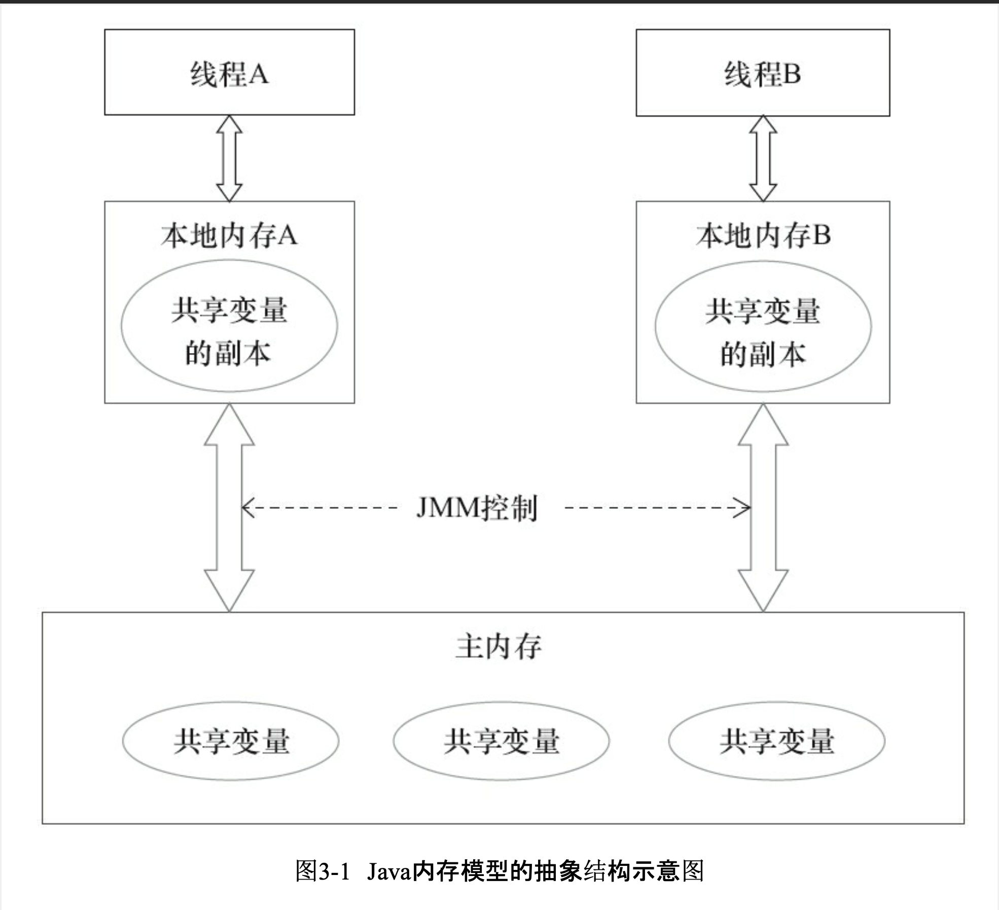

内存模型：在特定的操作协议下，对特定的内存或高速缓存进行读写访问的过程抽象

### **原子性、可见性、有序性**

原子性：

可见性：指当一个线程修改了共享变量的值，其他线程能立刻得知这个修改

- synchronized通过对一个变量进行unlock操作之前，必须先把此变量同步回主内存中保证
- volatile通过保证新值能立即同步回主内存、结合缓存一致性原则保证

有序性：

先行先发原则

- 是java内存模型中定义的两项操作之间的偏序关系

# volatile

### volatile内存语义

#### 写的内存语义

>当写一个volatile变量时，JMM会把该线程对应的本地内存中的共享变量值刷新到主内存

#### 读的内存语义

>当读一个volatile变量时，JMM会把该线程对应的本地内存置为无效。线程接下来将从主内存中读取共享变量

如果我们把volatile写和volatile读两个步骤综合起来看的话，在读线程B读一个volatile变量后，写线程A在写这个volatile变量之前所有可见的共享变量的值都将立即变得对读线程B可见。

**下面对volatile写和volatile读的内存语义做个总结：**

- 线程A写一个volatile变量，实质上是线程A向接下来将要读这个volatile变量的某个线程发出了（其对共享变量所做修改的）消息。

- 线程B读一个volatile变量，实质上是线程B接收了之前某个线程发出的（在写这个volatile变量之前对共享变量所做修改的）消息。

- 线程A写一个volatile变量，随后线程B读这个volatile变量，这个过程实质上是线程A通过主内存向线程B发送消息。

- volatile修饰的共享变量进行写操作时会多出一行lock前缀的的汇编代码
- 实现规则
- 1. Lock前缀指令会引起**本**处理器缓存回写到内存。
  2. 一个处理器的缓存回写到内存会导致其他处理器的缓存无效
- 语义
- - 保证可见性
- 
- - 禁止指令重排优化

通过内存屏障

- 不保证原子性

# happens-before

as-if-serial语义保证单线程内程序的执行结果不被改变，happens-before关系保证正确同步的多线程程序的执行结果不被改变。

### 规则

> 1. 程序顺序规则：一个线程中的每个操作，happens-before于该线程中的任意后续操作。
> 2. 监视器锁规则：对一个锁的解锁，happens-before于随后对这个锁的加锁。
> 3. volatile变量规则：对一个volatile域的写，happens-before于任意后续对这个volatile域的读。
> 4. 线程启动规则：Thread 对象的 start()方法 happen—before 此线程的每一个动作。
> 5. 线程终止规则：线程的所有操作都 happen—before 对此线程的终止检测，可以通过 Thread.join()方法结束 Thread.isAlive()的返回值等手段检测到线程已经终止执行。
> 6. 线程中断规则：对线程 interrupt()方法的调用 happen—before 发生于被中断线程的代码检测到中断时事件的发生。
> 7. 对象终结规则：一个对象的初始化完成（构造函数执行结束）happen—before 它的 finalize()方法的开始。
> 8. 传递性：如果A happens-before B，且B happens-before C，那么A happens-before C。

