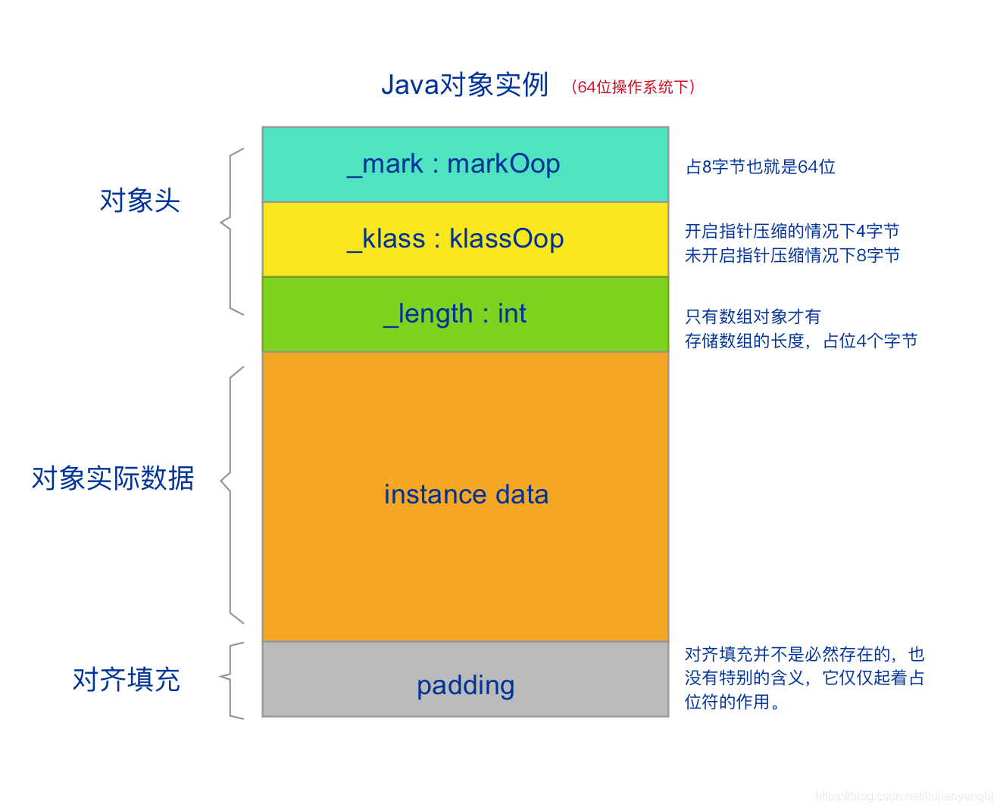
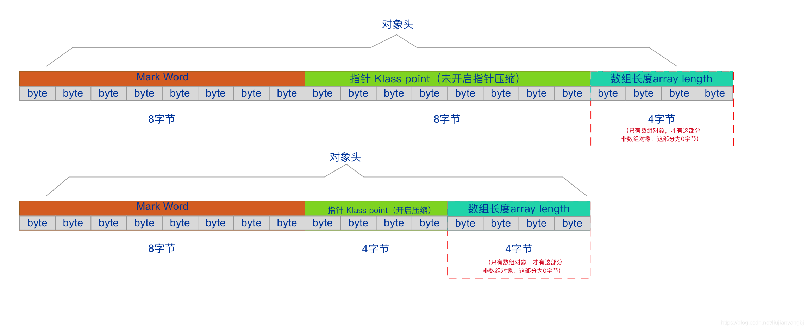
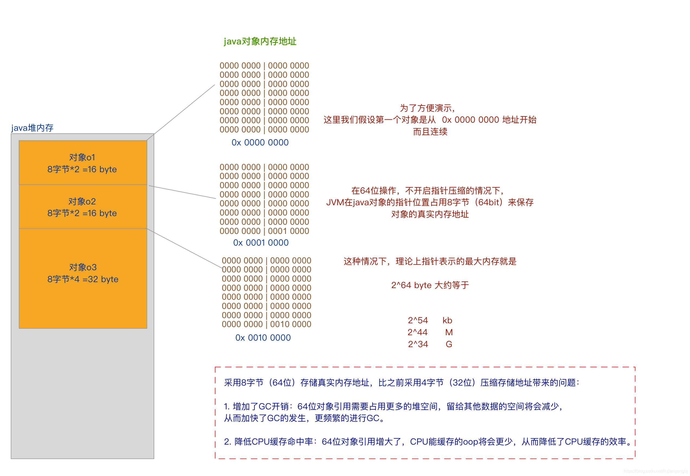
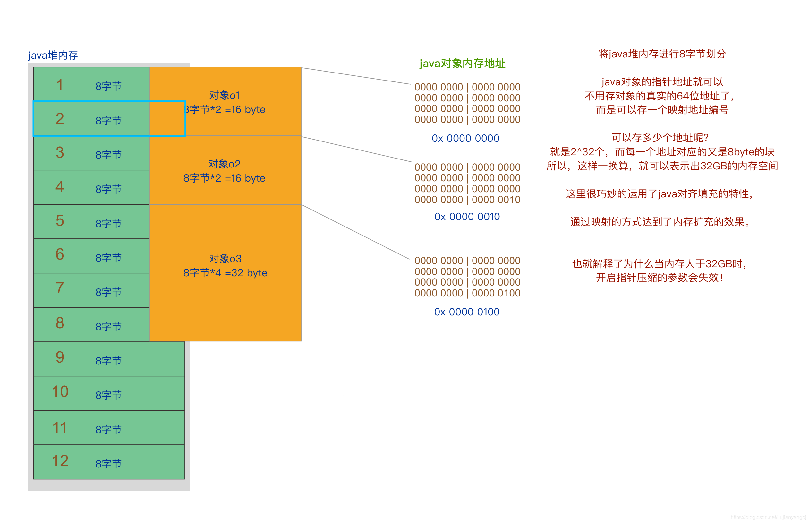

# 前言
在网上大家很多都看到过这样一句话：“JVM内存最好不要超过32G”。
今天我们就来分析一下为什么？32G到底是怎么算出来的。

# JAVA对象模型
我们先了解一下，一个JAVA对象的存储结构。在Hotspot虚拟机中，对象在内存中的存储布局分为 3 块区域：对象头（Header）、实例数据（Instance Data）和对齐填充（Padding）。

### 1、对象头（Header）
对象头，又包括三部分：MarkWord、元数据指针、数组长度。
下面图是64位系统下的对象头布局

- MarkWord
  - 用于存储对象运行时的数据，比如HashCode、锁状态标志、GC分代年龄等。这部分在64位操作系统下，占8字节（64bit），在32位操作系统下，占4字节（32bit）。

- 指针
  - 对象指向它的类元数据的指针，虚拟机通过这个指针来确定这个对象是哪个类的实例。
    这部分就涉及到一个指针压缩的概念，在开启指针压缩的情况下，占4字节（32bit），未开启情况下，占8字节（64bit），现在JVM在1.6之后，在64位操作系统下都是默认开启的。

- 数组长度
  - 这部分只有是数组对象才有，如果是非数组对象，就没这部分了，这部分占4字节（32bit）。

### 2、实例数据（Instance Data）
用于存储对象中的各种类型的字段信息（包括从父类继承来的）。

### 3、对齐填充（Padding）
java对象的大小默认是按照8字节对齐，也就是说java对象的大小必须是8字节的倍数。如果算到最后不够8字节的话，那么就会进行对齐填充。
那么为什么非要进行8字节对齐呢？这样岂不是浪费了空间资源？

> Scott oaks在书上给出的理由是：
> 其实在JVM中（不管是32位的还是64位的），对象已经按8字节边界对齐了;对于大部分处理器，这种对齐方案都是最优的。所以使用压缩的oop并不会损失什么。如果JVM
> 中的第一个对象保存到位置0，占用57字节，那下一个对象就要保存到位置64，浪费了7
> 字节，无法再分配。这种内存取舍是值得的（而且不管是否使用压缩的oop，都是这样），因为在8字节对齐的位置，对象可以更快地访问。
> 不过这也是为什么JVM没有尝试模仿36位引用（可以访问64GB的内存）的原因。在那种情况下，对象就要在16字节的边界上对齐，在堆中保存压缩指针所节约的成本，就被为对齐对象而浪费的内存抵消了。

**也就说，8字节对齐，是为了效率的提升，以空间换时间的一种方案。当然你还可以16字节对齐。但是8字节是最优选择。**

# 指针压缩原理
为什么对象指针，可以用8字节存也可以用4字节存？4字节存不会有什么问题吗？

### 1、不开启指针压缩
首先，我们来分析如果不开启指针压缩的情况下是，java对象是怎么存储的

采用8字节（64位）存储真实内存地址，比之前采用4字节（32位）压缩存储地址带来的问题：

增加了GC开销：64位对象引用需要占用更多的堆空间，留给其他数据的空间将会减少，
从而加快了GC的发生，更频繁的进行GC。

降低CPU缓存命中率：64位对象引用增大了，CPU能缓存的oop将会更少，从而降低了CPU缓存的效率。

### 2、开启指针压缩
既然64位存储内存地址，会导致了这么多问题，那么我们可以不可以找一种方法，既使用之前的4字节（32位）存指针地址，又可以扩大内存的方法呢？

答案就是采用指针压缩技术！！

4个字节，32位，可以表示2^32 个地址，如果这个地址是真实内存地址的话，那么由于CPU寻址的最小单位是byte，也就是 2^32 byte = 4GB。

如果内存地址是指向 bit的话，32位的最大寻址范围其实是 512MB，但是由于内存里，将8bit为一组划分，所以内存地址就其实是指向的8bit为一组的byte地址，所以32位可以表示的容量就扩充了8倍，就变成了4GB。

上面这个原理一定要明白，才能理解下面的指针压缩原理，不明白可以先看一下我的这篇文章。

4字节，8位最大表示4GB内存。那么Java是怎么做到 4个字节表示32GB呢？怎有扩大了8倍？？？

这就要使用到之前提到的Java的对齐填充机制了。
Java的8字节对齐填充，就像是内存的8bit为一组，变为1byte一样。
这里的压缩指针，不是真实的操作系统内存地址，而是Java进行8byte映射之后的地址，所以也相对于操作系统的指针有进行的8倍的扩容。

看下图：
JVM就将堆内存进行了块划分，以8字节为最小单位进行划分。

将java堆内存进行8字节划分

java对象的指针地址就可以不用存对象的真实的64位地址了，而是可以存一个映射地址编号。
这样4字节就可以表示出2^32个地址，而每一个地址对应的又是8byte的内存块。
所以，再乘以8以后，一换算，就可以表示出32GB的内存空间。

这里很巧妙的运用了java对齐填充的特性，通过映射的方式达到了内存扩充的效果。

想一想？这里运用的原理是不是和操作系统32位表示4GB内存的原理一毛一样！！！
我想着也是java做对齐填充的一重大原因吧！！

**也就解释了为什么当内存大于32GB时，开启指针压缩的参数会失效！**
所以也网上建议大家在64位系统系下，JAVA的堆内存设置最好不要超过32G，一旦超过32G后，指针压缩就会失效，然后带来GC的触发频次变高，而且造成空间浪费。

> 注意：
> 32G是个近似值，这个临界值跟JVM和平台有关，当我们线上真正启动服务的时候直接设置 -Xmx=32GB 的时候很可能导致 CompressedOop 失效，那我们怎么确定当前环境下最大内存设置多大才且最大限度的使用内存才能启动 CompressedOop 呢？我们可以通过增加JVM参数 -XX:+PrintFlagsFinal，验证UseCompressedOops的值，从而得知，到底是不是真的开启了压缩指针，还是压缩指针失效！