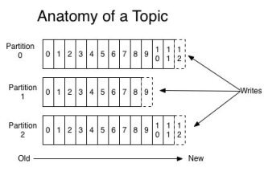
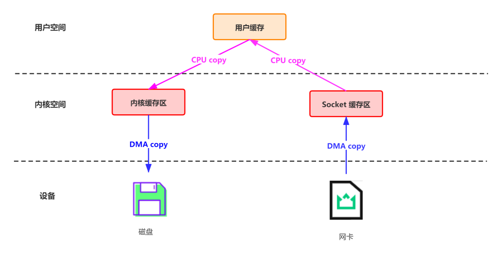
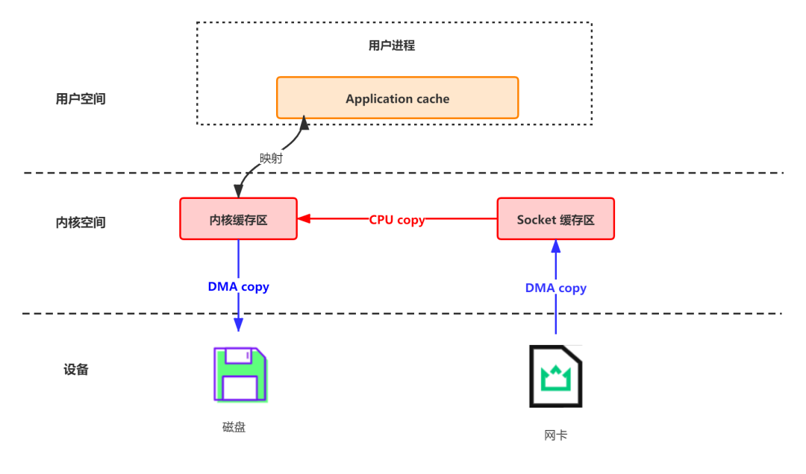
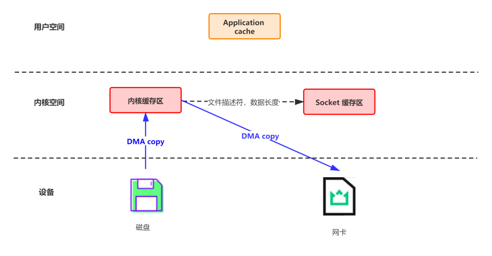

# 原因一：顺序读写磁盘



   - 顺序读写，是kafka利用磁盘特性的一个重要体现。
   - 顺序读写磁盘比随机读写快3个数量级
   - kafka将来自Producer的数据，顺序追加在partition，partition就是一个文件，以此实现顺序写入。
   - Consumer从broker读取数据时，因为自带了偏移量，接着上次读取的位置继续读，以此实现顺序读。


# 原因二：页缓存

为了优化读写性能，Kafka利用了操作系统本身的Page Cache，就是利用操作系统自身的内存而不是JVM空间内存。这样做的好处有：

- 避免Object消耗：如果是使用 Java 堆，Java对象的内存消耗比较大，通常是所存储数据的两倍甚至更多。
- 避免GC问题：随着JVM中数据不断增多，垃圾回收将会变得复杂与缓慢，使用系统缓存就不会存在GC问题

相比于使用JVM或in-memory cache等数据结构，利用操作系统的Page Cache更加简单可靠。

首先，操作系统层面的缓存利用率会更高，因为存储的都是紧凑的字节结构而不是独立的对象。

其次，操作系统本身也对于Page Cache做了大量优化，提供了 write-behind、read-ahead以及flush等多种机制。

再者，即使服务进程重启，系统缓存依然不会消失，避免了in-process cache重建缓存的过程。

通过操作系统的Page Cache，Kafka的读写操作基本上是基于内存的，读写速度得到了极大的提升。


# 原因三：零拷贝

   - 零拷贝并不是不需要拷贝，而是减少不必要的拷贝次数
   - 数据直接在内核完成输入和输出，不需要拷贝到用户空间再写出去。
   - kafka数据写入磁盘前，数据先写到进程的内存空间。
   - consumer从broker读取数据，采用sendfile，将磁盘文件读到OS内核缓冲区后，直接转到socket buffer进行网络发送。


## 3.1 过程一： 网络数据持久化到磁盘 (Producer到Broker)

传统模式下，数据从网络传输到文件需要 4 次数据拷贝、4 次上下文切换和两次系统调用。

```java
data = socket.read()				// 读取网络数据 
File file = new File() 
file.write(data)					  // 持久化到磁盘 
file.flush()
```

### 3.1.1 这一过程实际上发生了**四次数据拷贝**：

1. 首先通过**DMA Copy**将网络数据拷贝到内核态 Socket Buffer

2. 然后应用程序将内核态 Buffer 数据读入用户态**（CPU Copy）**

3. 接着用户程序将用户态 Buffer 再拷贝到内核态**（CPU Copy）**

4. 最后通过 **DMA copy** 将数据拷贝到磁盘文件

   

### 3.1.2 同时，还伴随着**四次上下文切换**，



​	对于 kafka 来说，Producer生产的数据存到 broker，这个过程读取到socket buffer的网络数据，其实可以直接在内核空间完成落盘。并没有必要将socket buffer的网络数据，读取到应用进程缓冲区；在这里应用进程缓冲区其实就是 broker，broker收到生产者的数据，就是为了持久化。在此特殊场景下：接收来自 socket buffer 的网络数据，应用进程不需要中间处理、直接进行持久化时。**可以使用 mmap 内存文件映射**。

### 3.1.3 Memory Mapped Files（mmap）

- 简称mmap
- **作用**

  - 将磁盘文件映射到内存, 用户通过修改内存就能修改磁盘文件。
- **工作原理**

  - 是直接利用操作系统的Page来实现文件到物理内存的直接映射。完成映射之后你对物理内存的操作会被同步到硬盘上（操作系统在适当的时候）
- 通过mmap，进程像读写硬盘一样读写内存（当然是虚拟机内存为我们兜底。使用这种方式可以获取很大的I/O提升，省去了用户空间到内核空间复制的开销
- **缺陷**
  - 不可靠，写到mmap中的数据并没有被真正的写到硬盘，操作系统会在程序主动调用flush的时候才把数据真正的写到硬盘。Kafka提供了一个参数——producer.type来控制是不是主动flush；如果Kafka写入到mmap之后就立即flush然后再返回Producer叫同步(sync)；写入mmap之后立即返回Producer不调用flush叫异步(async)。
  



### 3.1.4 Java NIO对文件映射的支持

- Java NIO，提供了一个`MappedByteBuffer`类可以用来实现内存映射。

- MappedByteBuffer只能通过调用`FileChannel的map()`取得，再没有其他方式。FileChannel.map()是抽象方法，具体实现是在 FileChannelImpl.c 可自行查看JDK源码，其map0()方法就是调用了Linux内核的mmap的API。

  ```java
  // java.nio.channels.FileChannel#map
  public abstract MappedByteBuffer map(MapMode mode, long position, long size)throws IOException;
  ```
  
- 使用 MappedByteBuffer类要注意的是：mmap的文件映射，在full gc时才会进行释放。当close时，需要手动清除内存映射文件，可以反射调用sun.misc.Cleaner方法。


## 3.2 过程二：磁盘文件通过网络发送（Broker到Consumer）

传统方式实现：先读取磁盘、再用 socket 发送，实际也是进过四次 copy

```java
buffer = File.read 
Socket.send(buffer)
```


### 3.2.1 这一过程可以类比上边的生产消息：

1. 首先通过系统调用将文件数据读入到内核态 Buffer（**DMA Copy**）
2. 然后应用程序将内存态 Buffer 数据读入到用户态 Buffer（**CPU Copy**）
3. 接着用户程序通过 Socket 发送数据时将用户态 Buffer 数据拷贝到内核态 Buffer（**CPU Copy**）
4. 最后通过 **DMA Copy**将数据拷贝到 NIC Buffer


Linux 2.4+ 内核通过 sendfile 系统调用，提供了零拷贝。数据通过 DMA 拷贝到内核态 Buffer 后，直接通过 DMA 拷贝到 NIC Buffer，无需 CPU 拷贝。这也是零拷贝这一说法的来源。除了减少数据拷贝外，因为整个读文件 - 网络发送由一个sendfile 调用完成，整个过程**只有两次上下文切换**，因此大大提高了性能。




- 可以这么做的原因：这种场景，读取磁盘文件后，不需要做其他处理，直接用网络发送出去。试想，如果读取磁盘的数据需要用程序进一步处理的话，必须要经过第二次和第三次数据copy，让应用程序在内存缓冲区处理。

- Kafka 在这里采用的方案是通过 NIO 的 `transferTo/transferFrom` 调用操作系统的 **sendfile** 实现零拷贝。总共发生 2 次内核数据拷贝、2 次上下文切换和一次系统调用，消除了 CPU 数据拷贝

- 其实这项零拷贝技术，直接从内核空间（DMA的）到内核空间（Socket的)、然后发送网卡。
  应用的场景非常多，如Tomcat、Nginx、Apache等web服务器返回静态资源等，将数据用网络发送出去，都运用了sendfile。
  简单理解 sendfile(in,out)就是，磁盘文件读取到操作系统内核缓冲区后、直接扔给网卡，发送网络数据。


### 3.2.2 Java NIO对sendfile的支持

- 就是`FileChannel.transferTo()/transferFrom()`

```java
// java.nio.channels.FileChannel#transferTo
public abstract long transferTo(long position, long count, WritableByteChannel target) throws IOException;

// java.nio.channels.FileChannel#transferFrom
public abstract long transferFrom(ReadableByteChannel src, long position, long count) throws IOException;
```

- 把磁盘文件读取OS内核缓冲区后的fileChannel，直接转给socketChannel发送；底层就是sendfile。消费者从broker读取数据，就是由此实现。


具体来看，Kafka 的数据传输通过 `TransportLayer` 来完成，其子类 `PlaintextTransportLayer` 通过Java NIO 的 FileChannel 的 transferTo 和 transferFrom 方法实现零拷贝

```java
// org.apache.kafka.common.network.PlaintextTransportLayer#transferFrom
@Override
public long transferFrom(FileChannel fileChannel, long position, long count) throws IOException {
    return fileChannel.transferTo(position, count, socketChannel);
}
```

##3.3 mmap 和 sendfile总结

1. 都是Linux内核提供、实现零拷贝的API；
2. sendfile 是将读到内核空间的数据，转到socket buffer，进行网络发送；
3. mmap将磁盘文件映射到内存，支持读和写，对内存的操作会反映在磁盘文件上。


# 参考

> https://zhuanlan.zhihu.com/p/78335525
>
> https://mp.weixin.qq.com/s/iy1UqDYuai_3UnusZ-jq4w