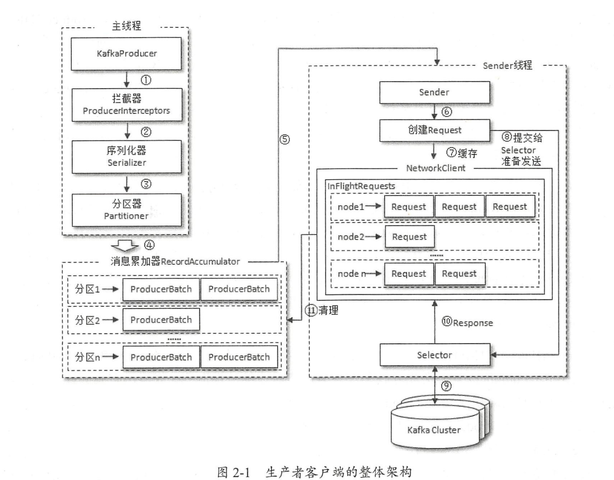

## 生产者客户端架构

### 过程

1. 确认数据要发送到的 topic 的 metadata 是可用的（如果该 partition 的 leader 存在则是可用的，如果开启权限时，client 有相应的权限），如果没有 topic 的 metadata 信息，就需要获取相应的 metadata；
2. 序列化 record 的 key 和 value；
3. 获取该 record 要发送到的 partition（可以指定，也可以根据算法计算）；
4. 向 accumulator 中追加 record 数据，数据会先进行缓存；
5. 如果追加完数据后，对应的 RecordBatch 已经达到了 batch.size 的大小（或者batch 的剩余空间不足以添加下一条 Record），则唤醒 `sender` 线程发送数据。

### acks
- 1: 默认值即为1。生产者发送消息之后，只要分区的leader副本成功写入消息，那么它就会收到来自服务端的成功响应 
- 0：生产者发送消息之后不需要等待任何服务端的响应
- -1/all：生产者在消息发送之后，需要等待`ISR`中的所有副本都成功写入消息之后才能够收到来自服务端的成功响应

### partition值的计算

分为三种情况：

1. 指明 partition 的情况下，直接将指明的值直接作为 partiton 值；
2. 没有指明 partition 值但有 key 的情况下，将 key 的 hash 值与 topic 的 partition 数进行取余得到 partition 值；
3. 既没有 partition 值又没有 key 值的情况下，第一次调用时随机生成一个整数（后面每次调用在这个整数上自增），将这个值与 topic 可用的 partition 总数取余得到 partition 值，也就是常说的 `round-robin` 算法。

### BufferPool

### Refer

> https://objcoding.com/2020/09/13/kafka-producer-cache-pool/

