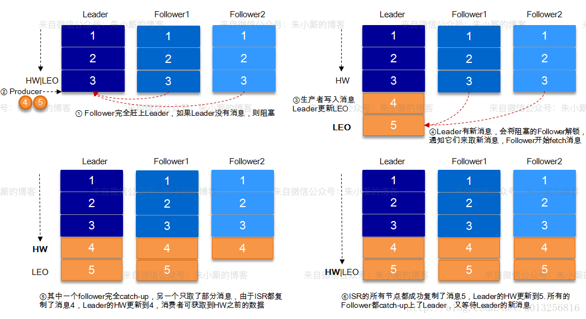

高可用：

通过partition和副本机制保证

如何保证消息不重复消费

1. 消费者保证业务幂等性

>如何保证消息的可靠性传输？如何保证消息不丢失？

1. 生产端
   - 设置`ack = all`，确保写入所有replica后，才认为是写成功了
   - 设置`retries = Max`，要求一旦写入失败，就无限重试
   
   > **request.required.acks**参数来设置数据可靠性的级别：
   >
   > - 1（默认）：这意味着producer在ISR中的leader已成功收到数据并得到确认。如果leader宕机了，则会丢失数据。
   > - 0：这意味着producer无需等待来自broker的确认而继续发送下一批消息。这种情况下数据传输效率最高，但是数据可靠性确是最低的。
   > - -1：producer需要等待ISR中的所有follower都确认接收到数据后才算一次发送完成，可靠性最高。但是这样也不能保证数据不丢失，比如当ISR中只有leader时（前面ISR那一节讲到，ISR中的成员由于某些情况会增加也会减少，最少就只剩一个leader），这样就变成了acks=1的情况。
   
2. 消费端
   - 关闭自动提交offset，消费完毕后，进行主动提交
   
3. broker（kafka服务端）
   - 确保每个partition要设置副本，设置`replication.factor`参数大于1
   - 设置至少一个flower和leader保持联系，设置`min.insync.replicas`参数大于1

> 如何保证消息的顺序性？

kafka保证同一个topic中的同一个partition内消息有序

1. 可以将需要保证顺序的消息设置相同的key，这样保证发送到相同的partition，进而保证有序

2. 如果消费者通过多线程消费，可以在消费前写入内存队列（相同key的写入同一个队列），每个队列对应一个线程进行消费，进而保证相同key的消息被顺序消费

3. 还有种方式就是使用线程池，对消息通过partition/key取模，计算出消息的线程，保证相同partition的一定由同一个线程处理，保证有顺序性

   

- at most once: 至多 一次。消息可能会丢失，但绝对不会重复传输。
-  at least once:  最少一次。消息绝不会丢失，但可能会重复传输。 
- exactly once: 恰好一次。每条消息肯定会被传输一次且仅传输一次。

**副本**

- 副本是相对分区而言的，即副本是分区的副本
- 副本位于不同的broker中
-  leader 副本对外提供服务， follower 副本只负 责数据同步。
- 分区中的所有副本统称为` AR`， 而 ISR 是指与 leader 副本保持同步状态的副本集合， 当然 leader副本本身也是这个集合中的一员

### ISR (In-Sync Replicas)

指副本同步队列， 所有的副本（replicas）统称为Assigned Replicas，即AR。ISR是AR中的一个子集，由leader维护ISR列表，follower从leader同步数据有一些延迟（包括延迟时间replica.lag.time.max.ms和延迟条数~~replica.lag.max.messages~~两个维度, 当前最新的版本0.10.x中只支持**replica.lag.time.max.ms**这个维度），任意一个超过阈值都会把follower剔除出ISR, 存入OSR（Outof-Sync Replicas）列表，新加入的follower也会先存放在OSR中。AR=ISR+OSR。

Kafka的ISR的管理最终都会反馈到Zookeeper节点上。具体位置为：`/brokers/topics/[topic]/partitions/[partition]/state`。目前有两个地方会对这个Zookeeper的节点进行维护：

1. Controller来维护：Kafka集群中的其中一个Broker会被选举为Controller，主要负责Partition管理和副本状态管理，也会执行类似于重分配partition之类的管理任务。在符合某些特定条件下，Controller下的LeaderSelector会选举新的leader，ISR和新的leader_epoch及controller_epoch写入Zookeeper的相关节点中。同时发起LeaderAndIsrRequest通知所有的replicas。
2. leader来维护：leader有单独的线程定期检测ISR中follower是否脱离ISR, 如果发现ISR变化，则会将新的ISR的信息返回到Zookeeper的相关节点中。

**LEO** 

标识每个分区中最后一条消息的下一个位置，分区的每个副本都有自己的 LEO,

**HW**

ISR 中**最小**的 LEO 即为 HW，俗称高水位，消费者只能拉取到 HW 之前的消息。

下图详细的说明了当producer生产消息至broker后，ISR以及HW和LEO的流转过程：

采用**主写主读**的生产消费模型，不支持读写分离。原因：

- 数据一致性问题
- 延时问题
- 负载已经均衡的，读写分离没收益，不必要

### 幂等性

Kafka内部会自动为每个Producer分配一个producer id(PID)，broker端会为producer每个Partition维护一个<PID,Partition> -> sequence number映射。sequence number时从0开始单调递增的。

1. PID（Producer ID），用来标识每个 producer client；
2. sequence numbers，client 发送的每条消息都会带相应的 sequence number，Server 端就是根据这个值来判断数据是否重复。

对于新接受到的消息，broker端会进行如下判断：

- 如果新消息的sequence number正好是broker端维护的<PID,Partition> -> sequence number大1，说broker会接受处理这条消息。
- 如果新消息的sequence number比broker端维护的sequence number要小，说明时重复消息，broker可以将其直接丢弃
- 如果新消息的sequence number比broker端维护的sequence number要大过1，说明中间存在了丢数据的情况，那么会响应该情况，对应的Producer会抛出OutOfOrderSequenceException。

引入序列号来实现幕等也只 是针对每一对<PID， 分区>而言的，也就是说， Kafka 的霖等只 能保证单个生产者会话( session)中单分区的事等

refer

> http://matt33.com/2018/11/04/kafka-transaction/
> http://matt33.com/2018/10/24/kafka-idempotent/