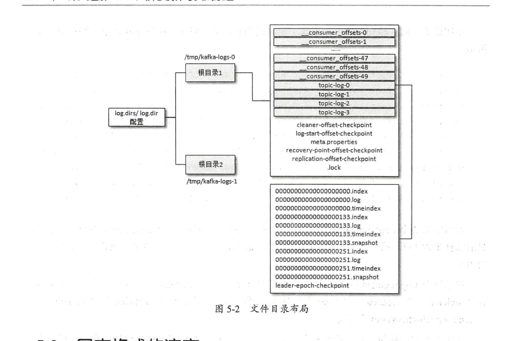
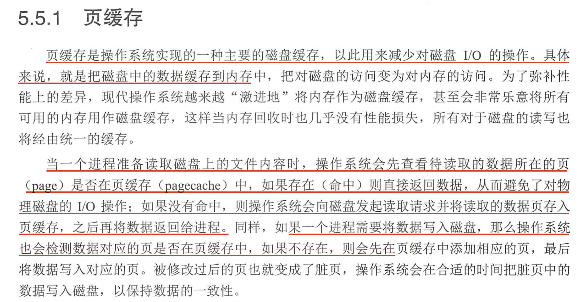

- **Broker**：消息中间件处理结点，一个Kafka节点就是一个broker，多个broker可以组成一个Kafka集群；
- **Topic**：一类消息，例如page view日志、click日志等都可以以topic的形式存在，Kafka集群能够同时负责多个topic的分发；
- **Partition**：topic物理上的分组，一个topic可以分为多个partition，每个partition是一个有序的队；
- **Segment**：每个partition又由多个segment file组成；
- **offset**：每个partition都由一系列有序的、不可变的消息组成，这些消息被连续的追加到partition中。partition中的每个消息都有一个连续的序列号叫做offset，用于partition唯一标识一条消息；
- **message**：这个算是kafka文件中最小的存储单位，即是 a commit log。

消息是持久化至`磁盘`!

## 1. 文件目录布局

## 

数据存储topic.png

segment
segment.png
segment的索引文件中存储着大量的元数据，数据文件中存储着大量消息，索引文件中的元数据指向对应数据文件中的message的物理偏移地址。以索引文件中的3，497为例，在数据文件中表示第3个message（在全局partition表示第368772个message），以及该消息的物理偏移地址为497。

注：Partition中的每条message由offset来表示它在这个partition中的偏移量，这个offset并不是该Message在partition中实际存储位置，而是逻辑上的一个值（如上面的3），但它却唯一确定了partition中的一条Message（可以认为offset是partition中Message的id）。

**写message**

- 消息从java堆转入page cache(即物理内存)。
- 由异步线程刷盘,消息从page cache刷入磁盘。

**读message**

- 消息直接从page cache转入socket发送出去。
- 当从page cache没有找到相应数据时，此时会产生磁盘IO,从磁 盘Load消息到page cache,然后直接从socket发出去

## 2. 磁盘存储

- 顺序写盘的速度不仅比随机写盘的速度快，而且也比随机写内存的速度快。

- Kafka 在设计时采用了文件追加的方式来写入消息，即只能在日志文件的尾部追加新的消

  息，井且也不允许修改己写入的消息，这种方式属于典型的顺序写盘的操作

### 2.1 页缓存

- producer生产消息时，会使用pwrite()系统调用对应到Java NIO中是FileChannel.write() API按偏移量写入数据，并且都会先写入page cache里。consumer消费消息时，会使用`sendfile()`系统调用对应`FileChannel.transferTo()` API，零拷贝地将数据从page cache传输到broker的Socket buffer，再通过网络传输。

- 图中没有画出来的还有leader与follower之间的同步，这与consumer是同理的：只要follower处在ISR中，就也能够通过零拷贝机制将数据从leader所在的broker page cache传输到follower所在的broker。
- 同时，page cache中的数据会随着内核中flusher线程的调度以及对sync()/fsync()的调用写回到磁盘，就算进程崩溃，也不用担心数据丢失。另外，如果consumer要消费的消息不在page cache里，才会去磁盘读取，并且会顺便预读出一些相邻的块放入page cache，以方便下一次读取。

- 页缓存是操作系统实现的一种主要的磁盘缓存，以此用来减少对磁盘 I/O 的操作。具体来说，就是把磁盘中的数据缓存到内存中，把对磁盘的访问变成对内存的访问。
- Kafka 中大量使用了页缓存 ，这是 Kafka实现高吞吐的重要因素之 一。 虽然消息都是先被写入页缓存，然后由操作系统负责具体的刷盘任务的

​		Kafka中大量使用了页缓存， 这是Kafka实现高吞吐的重要因素之一。 虽然消息都是先被写入页缓存，然后由操作系统负责具体的刷盘任务的， 在Kafka中同样提供了同步刷盘及间断性强制刷盘( fsync)的功能，这些功能可以通过 log.flush.interval . messages、 log.flush .interval .ms 等参数来控制。同步刷盘可以提高消息的可靠性，防止由于机器 掉电等异常造成处于页缓存而没有及时写入磁盘的消息丢失。**不过笔者并不建议这么做，刷盘任务就应交由操作系统去调配，消息的可靠性应该由多副本机制来保障，而不是由同步刷盘这 种严重影响性能的行为来保障 。**

**注意事项**

- 对于单纯运行Kafka的集群而言，首先要注意的就是**为Kafka设置合适（不那么大）的JVM堆大小**。从上面的分析可知，Kafka的性能与堆内存关系并不大，而对page cache需求巨大。根据经验值，为Kafka分配6~8GB的堆内存就已经足足够用了，将剩下的系统内存都作为page cache空间，可以最大化I/O效率。

### 总结

Kafka高效文件存储设计特点：

- Kafka把topic中一个parition大文件分成多个小文件段，通过多个小文件段，就容易定期清除或删除已经消费完文件，减少磁盘占用。
- 通过索引信息可以快速定位message和确定response的最大大小。
- 通过index元数据全部映射到memory，可以避免segment file的IO磁盘操作。
- 通过索引文件稀疏存储，可以大幅降低index文件元数据占用空间大小。

refer:

 https://tech.meituan.com/2015/01/13/kafka-fs-design-theory.html

https://matt33.com/2016/03/08/kafka-store/

https://xie.infoq.cn/article/c06fea629926e2b6a8073e2f0

