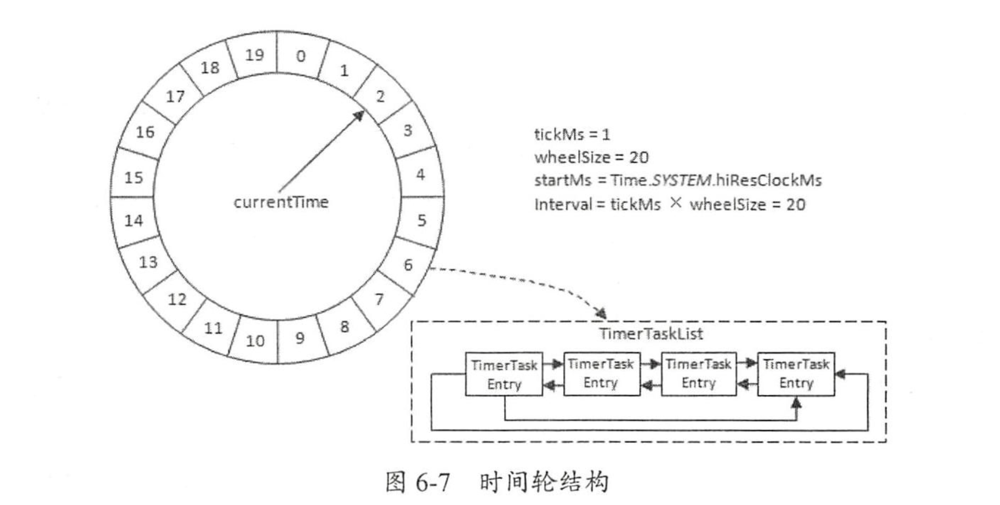
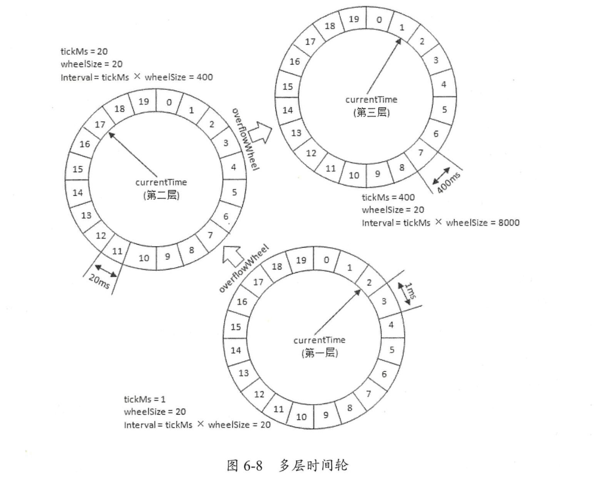

- tickMs: 时间跨度

- wheelSize: 时间轮中 bucket 的个数

- startMs: 开始时间

- interval：时间轮的整体时间跨度 = tickMs * wheelSize

- currentTime: tickMs 的整数倍，代表时间轮当前所处的时间

- - currentTime可以将整个时间轮划分为到期部分和未到期部分，currentTime当前指向的时间格也属于到期部分，表示刚好到期，需要处理此时间格所对应的TimerTaskList中的所有任务

整个时间轮的总体跨度是不变的，随着指针currentTime的不断推进，当前时间轮所能处理的时间段也在不断后移，总体时间范围在currentTime和currentTime+interval之间。

