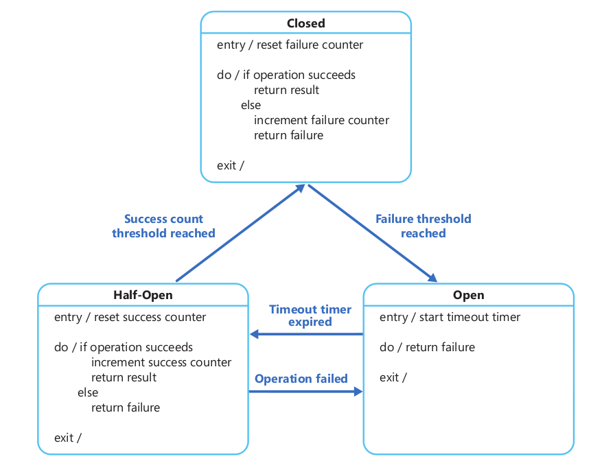

我们可以用状态机来实现 Circuit Breaker，它有以下三种状态：

- 关闭(**Closed**)：默认情况下Circuit Breaker是关闭的，此时允许操作执行。Circuit Breaker内部记录着最近失败的次数，如果对应的操作执行失败，次数就会续一次。如果在某个时间段内，失败次数（或者失败比率）达到阈值，Circuit Breaker会转换到开启(**Open**)状态。在开启状态中，Circuit Breaker会启用一个超时计时器，设这个计时器的目的是给集群相应的时间来恢复故障。当计时器时间到的时候，Circuit Breaker会转换到半开启(**Half-Open**)状态。
- 开启(**Open**)：在此状态下，执行对应的操作将会立即失败并且立即抛出异常。
- 半开启(**Half-Open**)：在此状态下，Circuit Breaker 会允许执行一定数量的操作。如果所有操作全部成功，Circuit Breaker就会假定故障已经恢复，它就会转换到关闭状态，并且重置失败次数。如果其中 **任意一次** 操作失败了，Circuit Breaker就会认为故障仍然存在，所以它会转换到开启状态并再次开启计时器（再给系统一些时间使其从失败中恢复）。

