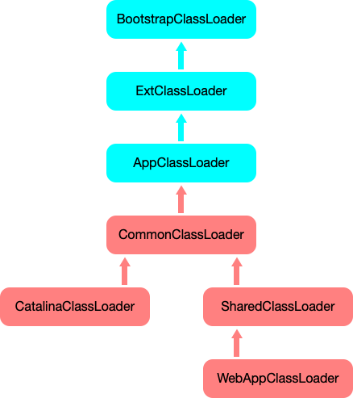

## Tomcat类加载机制要考虑的问题
1. 假如在Tomcat中运行了两个Web应用程序，两个Web应用中有同名的 Servlet，但是功能不同，Tomcat需要同时加载和管理这两个同名的Servlet 类，保证它们不会冲突，也就是说，Web应用之间的类需要隔离
2. 假如两个Web应用都依赖同一个第三方的JAR包，比如Spring，那Spring的JAR包被加载到内存后，Tomcat要保证这两个Web应用能够共享，也就是说Spring的JAR包只被加载一次，否则随着依赖的第三方JAR包增多，JVM 的内存会膨胀
3. Tomcat自身也是一个Java程序，需要隔离Tomcat本身的类和Web应用的类，避免相互影响，比如Web应用中定义了一个同名类导致Tomcat本身的类无法加载


所以，Tomcat是如何来解决这些问题的？答案是通过设计多层次的类加载器。




### 1.1 WebAppClassLoader
首先来看第一个问题，假如我们使用JVM默认AppClassLoader来加载Web应用，AppClassLoader只能加载一个 Servlet 类，在加载第二个同名 Servlet 类时，AppClassLoader会返回第一个Servlet类的Class实例，这是因为在 AppClassLoader看来，同名的Servlet类只被加载一次。

因此Tomcat的解决方案是自定义一个类加载器WebAppClassLoader，并且给每个Web应用创建一个类加载器实例。我们知道，Context容器组件对应一个Web应用，因此，每个Context容器负责创建和维护一个WebAppClassLoader加载器实例，这背后的原理是，不同的加载器实例加载的类被认为是不同的类，即使它们的类名相同。这就相当于在Java虚拟机内部创建了一个个相互隔离的Java类空间，每一个Web应用都有自己的类空间，Web应用之间通过各自的类加载器互相隔离。

### 1.2 SharedClassLoader
再来看第二个问题，本质需求是两个Web应用之间怎么共享库类，并且不能重复加载相同的类。我们知道，在双亲委托机制里，各个子加载器都可以通过父加载器去加载类，那么把需要共享的类放到父加载器的加载路径下应该就可以了，应用程序也正是通过这种方式共享JRE的核心类。因此Tomcat的设计者又加了一个类加载器SharedClassLoader，作为WebAppClassLoader的父加载器，专门来加载Web应用之间共享的类。如果WebAppClassLoader自己没有加载到某个类，就会委托父加载器SharedClassLoader去加载这个类，SharedClassLoader会在指定目录下加载共享类，之后返回给WebAppClassLoader，这样共享的问题就解决了。

### 1.3 CatalinaClassloader
第三个问题，如何隔离Tomcat本身的类和Web应用的类。我们知道，要共享可以通过父子关系，要隔离那就需要兄弟关系了。兄弟关系就是指两个类加载器是平行的，它们可能拥有同一个父加载器,但是两个兄弟类加载器加载的类是隔离的。基于此Tomcat又设计一个类加载器CatalinaClassloader，专门来加载Tomcat自身的类。

如果Tomcat和各Web应用之间需要共享一些类时该怎么办？

### 1.4 CommonClassLoader
老办法，还是再增加一个CommonClassLoader，作为CatalinaClassloader和SharedClassLoader的父加载器。CommonClassLoader能加载的类都可以CatalinaClassLoader和SharedClassLoader使用，而CatalinaClassLoader和 SharedClassLoader能加载的类则与对方相互隔离。WebAppClassLoader可以使用SharedClassLoader加载到的类，但各个WebAppClassLoader实例之间相互隔离。


### 1.5 线程类加载器
在JVM的实现中有一条隐含的规则，默认情况下，如果一个类由类加载器A加载，那么这个类的依赖类也是由相同的类加载器加载。比如 Spring 作为一个Bean工厂，它需要创建业务类的实例，并且在创建业务类实例之前需要加载这些类。Spring是通过调用Class.forName来加载业务类的，我们来看一下forName的源码:

```java
public static Class<?> forName(String className)
            throws ClassNotFoundException {
    Class<?> caller = Reflection.getCallerClass();
    return forName0(className, true, ClassLoader.getClassLoader(caller), caller);
}
// 可以看到在forName的函数里，会用调用者也就是Spring的加载器去加载业务类。
```


前面提到，Web应用之间共享的JAR包可以交给SharedClassLoader来加载，从而避免重复加载。Spring作为共享的第三方JAR包，它本身是由SharedClassLoader 来加载的，Spring又要去加载业务类，按照前面那条规则，加载Spring的类加载器也会用来加载业务类，但是业务类在Web应用目录下，不在SharedClassLoader的加载路径下，这该怎么办呢?

于是线程上下文加载器登场了，它其实是一种类加载器传递机制。为什么叫作“线程上下文加载器”呢，因为这个类加载器保存在线程私有数据里，只要是同一个线程，一旦设置了线程上下文加载器，在线程后续执行过程中就能把这个类加载器取出来用。因此Tomcat为每个Web应用创建一个WebAppClassLoarder类加载器，并在启动Web应用的线程里设置线程上下文加载器，这样Spring在启动时就将线程上下文加载器取出来，用来加载Bean。Spring取线程上下文加载的代码如下:

```java
ClassLoader cl = Thread.currentThread().getContextClassLoader();
```

