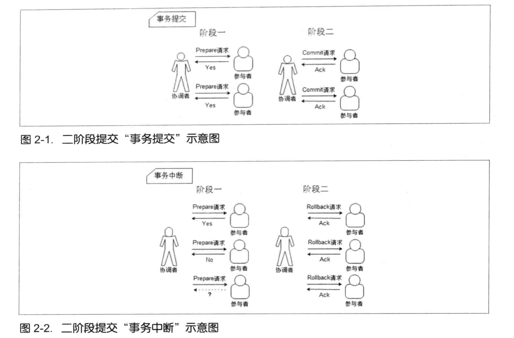

# 2PC

Two-Phase Commit，两阶段提交

### 阶段一：提交事务请求

> 也叫“投票阶段”，即各参与者投票表明是否要继续执行接下去要执行的事务提交操作

过程

1. 事务询问
2. 执行事务
3. 各参与者向协调者反馈事务询问的响应

### 阶段二：执行事务提交

过程

**执行事务提交**

1. 发送提交请求
2. 事务提交
3. 反馈事务提交结果
4. 完成事务

**中断事务**

1. 发送回滚请求
2. 事务回滚
3. 反馈事务回滚结果
4. 中断事务

### 缺点

1. **同步阻塞问题**

   执行过程中，所有参与节点都是事务阻塞型的。当参与者占有公共资源时，其他第三方节点访问公共资源不得不处于阻塞状态。

   

2. **单点故障**

   由于协调者的重要性，一旦协调者发生故障。参与者会一直阻塞下去。尤其在第二阶段，协调者发生故障，那么所有的参与者还都处于锁定事务资源的状态中，而无法继续完成事务操作。（如果是协调者挂掉，可以重新选举一个协调者，但是无法解决因为协调者宕机导致的参与者处于阻塞状态的问题）

   

3. **数据不一致**

   在二阶段提交的阶段二中，当协调者向参与者发送commit请求之后，发生了局部网络异常或者在发送commit请求过程中协调者发生了故障，这会导致只有一部分参与者接受到了commit请求。而在这部分参与者接到commit请求之后就会执行commit操作。但是其他部分未接到commit请求的机器则无法执行事务提交。于是整个分布式系统便出现了数据不一致性的现象。

   

4. 二阶段无法解决的问题

   协调者再发出commit消息之后宕机，而唯一接收到这条消息的参与者同时也宕机了。那么即使协调者通过选举协议产生了新的协调者，这条事务的状态也是不确定的，没人知道事务是否被已经提交。

# 3PC

Three-Phase Commit，三阶段提交

除了引入超时机制之外，3PC把2PC的准备阶段再次一分为二，这样三阶段提交就有`CanCommit`、`PreCommit`、`DoCommit`三个阶段。

### 2PC vs 3PC

相对于2PC，3PC主要解决的单点故障问题，并减少阻塞，因为一旦参与者无法及时收到来自协调者的信息之后，他会默认执行commit。而不会一直持有事务资源并处于阻塞状态。但是这种机制也会导致数据一致性问题，因为，由于网络原因，协调者发送的abort响应没有及时被参与者接收到，那么参与者在等待超时之后执行了commit操作。这样就和其他接到abort命令并执行回滚的参与者之间存在数据不一致的情况。

# 分布式一致算法——Paxos

解决的问题：Paxos 算法是分布式一致性算法用来解决一个分布式系统如何就某个值(决议)达成一致的问题。

