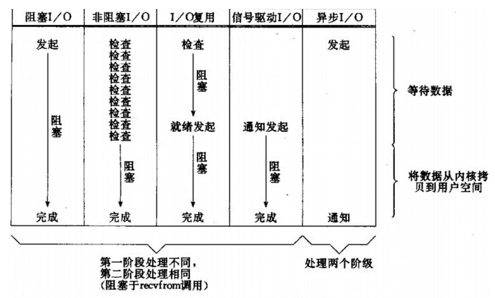

# 基本概念

## 文件描述符 fd

文件描述符（file descriptor，简称 fd）在形式上是一个非负整数。实际上，它是一个索引值，指向内核为每一个进程所维护的该进程打开文件的记录表。当程序打开一个现有文件或者创建一个新文件时，内核向进程返回一个文件描述符。在程序设计中，一些涉及底层的程序编写往往会围绕着文件描述符展开。但是文件描述符这一概念往往只适用于UNIX、Linux这样的操作系统。

在 Linux 中，内核将所有的外部设备都当做一个文件来进行操作，而对一个文件的读写操作会调用内核提供的系统命令，返回一个 fd，对一个 socket 的读写也会有相应的描述符，称为 socketfd（socket 描述符），实际上描述符就是一个数字，它指向内核中的一个结构体（文件路径、数据区等一些属性）。

## 用户空间和内核空间

虚拟空间

1. 内核空间
2. 用户空间

现在操作系统都是采用虚拟存储器，那么对32位操作系统而言，它的寻址空间（虚拟存储空间）为4G（2的32次方）。操作系统的核心是内核，独立于普通的应用程序，可以访问受保护的内存空间，也有访问底层硬件设备的所有权限。为了保证用户进程不能直接操作内核（kernel），保证内核的安全，操心系统将虚拟空间划分为两部分，一部分为内核空间，一部分为用户空间。针对linux操作系统而言，将最高的1G字节（从虚拟地址0xC0000000到0xFFFFFFFF），供内核使用，称为内核空间，而将较低的3G字节（从虚拟地址0x00000000到0xBFFFFFFF），供各个进程使用，称为用户空间。


## 进程切换

为了控制进程的执行，内核必须有能力挂起正在CPU上运行的进程，并恢复以前挂起的某个进程的执行。这种行为被称为进程切换。因此可以说，任何进程都是在操作系统内核的支持下运行的，是与内核紧密相关的。

从一个进程的运行转到另一个进程上运行，这个过程中经过下面这些变化：

1. 保存处理机上下文，包括程序计数器和其他寄存器。
2. 更新PCB信息。
3. 把进程的PCB移入相应的队列，如就绪、在某事件阻塞等队列。
4. 选择另一个进程执行，并更新其PCB。
5. 更新内存管理的数据结构。
6. 恢复处理机上下文。

refer: [进程切换](http://guojing.me/linux-kernel-architecture/posts/process-switch/)


# UNIX 的网络 IO 模型

#### 同步


#### 异步


### **阻塞与非阻塞**

实际上阻塞与非阻塞的概念，通常是针对底层的IO操作来说的。

#### 阻塞


#### 非阻塞


## 1. 同步阻塞IO(BIO)


在用户空间调用 `recvfrom`，系统调用直到数据包达到且被复制到应用进程的缓冲区中或中间发生异常返回，在这个期间进程会一直等待。进程从调用 `recvfrom` 开始到它返回的整段时间内都是被阻塞的，因此，被称为阻塞 IO 模型。


## 2. 同步非阻塞IO（NIO）

`recvfrom` 从应用到内核的时，如果该缓冲区没有数据，就会直接返回 `EWOULDBLOCK` 错误，一般都对非阻塞 IO 模型进行轮询检查这个状态，看看内核是不是有数据到来，流程如下图所示。


也就是说非阻塞的 `recvform` 系统调用调用之后，进程并没有被阻塞，内核马上返回给进程。

- 如果数据还没准备好，此时会返回一个 error。进程在返回之后，可以干点别的事情，然后再发起 `recvform` 系统调用。重复上面的过程，循环往复的进行 `recvform` 系统调用，这个过程通常被称之为**轮询**。

轮询检查内核数据，直到数据准备好，再拷贝数据到进程，进行数据处理。需要注意，拷贝数据整个过程，进程仍然是属于阻塞的状态。

在 Linux 下，可以通过设置 socket 使其变为 non-blocking。


## 3. IO多路复用

- IO 多路复用是一种**同步**IO模型，实现一个线程可以监视多个文件句柄；
- 一旦某个文件句柄就绪，就能够通知应用程序进行相应的读写操作；
- 没有文件句柄就绪就会阻塞应用程序，交出CPU。

```
多路是指网络连接，复用指的是同一个线程
```


IO 多路复用通过把多个 IO 阻塞复用到同一个 select 的阻塞上，从而使得系统在单线程的情况下，可以同时处理多个 client 请求，与传统的多线程/多进程模型相比，IO 多路复用的最大优势是系统开销小，系统不需要创建新的额外的进程或线程，也不需要维护这些进程和线程的运行，节省了系统资源，IO 多路复用的主要场景如下：

		1. Server 需要同时处理多个处于监听状态或者连接状态的 socket；
		2. Server 需要同时处理多种网络协议的 socket。

IO 多路复用实际上就是通过一种机制，一个进程可以监视多个描 fd，一旦某个 fd 就绪（一般是读就绪或者写就绪），能够通知程序进行相应的读写操作，目前支持 IO 多路复用的系统有 select、pselect、poll、epoll，但它们**本质上都是同步 IO**。

在 Linux 网络编程中，最初是选用 select 做轮询和网络事件通知，然而 select 的一些固有缺陷导致了它的应用受到了很大的限制，最终 Linux 选择 epoll。

### select

select 函数监视的 fd 分3类，分别是 `writefds`、`readfds`、和 `exceptfds`。调用后select 函数会阻塞，直到有 fd 就绪（有数据 可读、可写、或者有 except），或者超时（timeout 指定等待时间，如果立即返回设为 null 即可），函数返回。当select函数返回后，可以通过遍历 fdset，来找到就绪的 fd。

select 目前几乎在所有的平台上支持，其良好跨平台支持也是它的一个优点。**select 的一个最大的缺陷就是单个进程对打开的 fd 是有一定限制的，它由 `FD_SETSIZE` 限制，默认值是1024**，如果修改的话，就需要重新编译内核，不过这会带来网络效率的下降。

select 和 poll 另一个缺陷就是随着 fd 数目的增加，可能只有很少一部分 socket 是活跃的，但是 **select/poll 每次调用时都会线性扫描全部的集合，导致效率呈现线性的下降。**

### poll

poll 本质上和 select 没有区别，它将用户传入的数组拷贝到内核空间，然后查询每个 fd 对应的设备状态，如果设备就绪则在设备等待队列中加入一项并继续遍历，如果遍历完所有 fd 后没有发现就绪设备，则挂起当前进程，直到设备就绪或者主动超时，被唤醒后它又要再次遍历 fd。这个过程经历了多次无谓的遍历。

**它没有最大连接数的限制，原因是它是基于链表来存储的**，但是同样以下两个缺点：

1. 大量的 fd 的数组被整体复制于用户态和内核地址空间之间；
2. poll 还有一个特点是【水平触发】，如果报告了 fd 后，没有被处理，那么下次 poll 时会再次报告该 fd；
3. fd 增加时，线性扫描导致性能下降。

### epoll

epoll 支持水平触发和边缘触发，最大的特点在于边缘触发，它只告诉进程哪些 fd 变为就绪态，并且只会通知一次。还有一个特点是，epoll 使用【事件】的就绪通知方式，通过 `epoll_ctl` 注册 fd，一旦该 fd 就绪，内核就会采用类似 callback 的回调机制来激活该 fd，`epoll_wait` 便可以收到通知。

epoll的优点：

1. 没有最大并发连接的限制，它支持的 fd 上限受操作系统最大文件句柄数；
2. 效率提升，不是轮询的方式，不会随着 fd 数目的增加效率下降。epoll 只会对【活跃】的 socket 进行操作，这是因为在内核实现中 epoll 是根据每个 fd 上面的 callback 函数实现的，只有【活跃】的 socket 才会主动的去调用 callback 函数，其他 idle 状态的 socket 则不会。epoll 的性能不会受 fd 总数的限制。
3. select/poll 都需要内核把 fd 消息通知给用户空间，而 epoll 是通过内核和用户空间 `mmap` 同一块内存实现。

epoll 对 fd 的操作有两种模式：LT（level trigger）和ET（edge trigger）。LT 模式是默认模式，LT 模式与 ET 模式的区别如下：

- LT 模式：当 `epoll_wait` 检测到描述符事件发生并将此事件通知应用程序，应用程序可以不立即处理该事件，下次调用 `epoll_wait` 时，会再次响应应用程序并通知此事件；
- ET 模式：当 `epoll_wait` 检测到描述符事件发生并将此事件通知应用程序，应用程序必须立即处理该事件，如果不处理，下次调用 `epoll_wait` 时，不会再次响应应用程序并通知此事件。

### 三种模型的区别

| 类别             | select                                     | poll                   | epoll                                        |
| ---------------- | ------------------------------------------ | ---------------------- | -------------------------------------------- |
| 支持的最大连接数 | 由 `FD_SETSIZE` 限制                       | 基于链表存储，没有限制 | 受系统最大句柄数限制                         |
| fd 剧增的影响    | 线性扫描 fd 导致性能很低                   | 同 select              | 基于 fd 上 callback 实现，没有性能下降的问题 |
| 消息传递机制     | 内核需要将消息传递到用户空间，需要内核拷贝 | 同 select              | epoll 通过内核与用户空间共享内存来实现       |

介绍完 IO 多路复用之后，后续我们看一下 Java 网络编程中的 NIO 模型及其背后的实现机制。

### Refer

> https://www.huaweicloud.com/articles/11750f7c569c6df1494f5790b4edfb85.html
>
> http://matt33.com/2017/08/06/unix-io/#Linux-%E7%9A%84-IO-%E5%A4%9A%E8%B7%AF%E5%A4%8D%E7%94%A8%E6%A8%A1%E5%9E%8B


- `sync`: 函数只是将所有修改过的块缓冲区加入写队列，然后就返回，它并不等待实际写磁盘操作结束。所以不要觉得调用了sync函数，就觉得数据已安全的送到磁盘文件上，有可能会出现故障，可是sync函数是无法得知的.通常称为update的系统守护进程会周期性地（一般每隔30秒）调用sync函数。这就保证了定期冲洗内核的块缓冲区。命令sync(1)也调用sync函数**。sync是全局的，对整个系统都flush。**
- `fsync`: 函数**只针对单个文件**，只对由文件描述符filedes指定的单一文件起作用，并且等待写磁盘操作结束，然后返回。fsync不仅会同步更新文件数据，还会同步更新文件的属性（比如atime,mtime等）。fsync可用于数据库这样的应用程序，这种应用程序需要确保将修改过的块立即写到磁盘上。
- `fdatasync`: 当初设计是考虑到有特殊的时候一些基本的元数据比如atime，mtime这些不会对以后读取造成不一致性，因此少了这些元数据的同步可能会在性能上有提升。该函数类似于fsync，但它只影响文件的数据部分,如果该写操作并不影响读取刚写入的数据，则不需等待文件属性被更新。


## 4. 信号驱动 IO 模型

首先需要开启 socket 信号驱动 IO 功能，并通过系统调用 `sigaction` 执行一个信号处理函数（非阻塞，立即返回）。当数据就绪时，会为该进程生成一个 SIGIO 信号，通过信号回调通知应用程序调用 `recvfrom` 来读取数据，并通知主循环喊出处理数据，流程如下图所示。

[](http://matt33.com/images/linux/single-IO.png)信号驱动 IO 模型

## 5. 异步 IO 模型

告知内核启动某个事件，并让内核在整个操作完成后（包括将数据从内核复制到用户自己的缓冲区）通过我们，流程如下图所示。

[](http://matt33.com/images/linux/AIO.png)异步 IO 模型

与信号驱动模式的主要区别是：

- 信号驱动 IO 由内核通知我们何时可以开始一个 IO 操作；
- 异步 IO 操作由内核通知我们 IO 何时完成。

内核是通过向应用程序发送 signal 或执行一个基于线程的回调函数来完成这次 IO 处理过程，告诉用户 read 操作已经完成，在 Linux 中，通知的方式是信号：

1. 当进程正处于用户态时，应用需要立马进行处理，一般情况下，是先将事件登记一下，放进一个队列中；
2. 当进程正处于内核态时，比如正在以同步阻塞模式读磁盘，那么只能先把这个通知挂起来，等内核态的事情完成之后，再触发信号通知；
3. 如果这个进程现在被挂起来了，比如 sleep，那就把这个进程唤醒，等 CPU 空闲时，就会调度这个进程，触发信号通知。

## 几种 IO 模型比较

[](http://matt33.com/images/linux/IO-compact.png)
