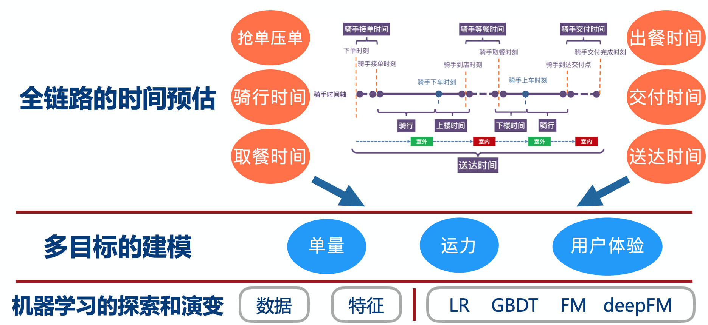
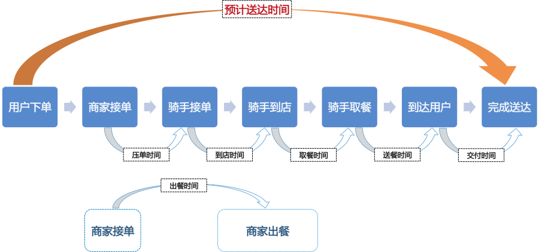

ETA: Estimated Time of Arrival, 预计送达时间, 用户下单后，配送人员在多长时间内将外卖送达到用户手中

## 美团

- ETA作为系统的调节中枢，需要平衡用户-骑手-商家-配送效率。
  - 从用户的诉求出发，尽可能快和准时，
  - 从骑手的角度出发，ETA太短会增大其配送难度。
  - 从调度角度出发，太长或太短都会影响配送效率。
  - 而从商家角度出发，都希望订单被尽可能派发出去，因为这关系到商家的收入。

- 骑手（接-到-取-送）
- 单量-运力-用户体验

- 特征维度逐步丰富到地址特征/轨迹特征/区域特征/时间特征/时序特征/订单特征等维度。

(1) 离线特征

a. 商户画像：商户平均送达时长、**到店时长**、取餐时长、出餐状况、单量、种类偏好、客单价、平均配送距离。

b. 配送区域画像：区域运力平均水平、骑手规模、单量规模、平均配送距离。

(2) 在线特征

a. 商家实时特征：商家订单挤压状况、过去N分钟出单量、过去N分钟进单量。

 b. 区域实时特征：在岗骑手实时规模、区域挤压（未取餐）单量、运力负载状况。 

c. 订单特征：配送距离、价格、种类、时段。

 d. 天气数据：温度、气压、降水量。

其中区域实时特征和商家实时特征与配送运力息息相关，运力是决定配送时长和用户体验的重要因素。

### refer

https://tech.meituan.com/2019/02/21/meituan-delivery-eta-estimation-in-the-practice-of-deep-learning.html
https://tech.meituan.com/2018/12/13/machine-learning-in-distribution-practice.html

https://tech.meituan.com/2017/11/24/gbdt.html

https://tech.meituan.com/2019/10/10/distribution-time-prediction-practice.html

## Uber

### refer

https://thenewstack.io/how-uber-eats-uses-machine-learning-to-estimate-delivery-times/